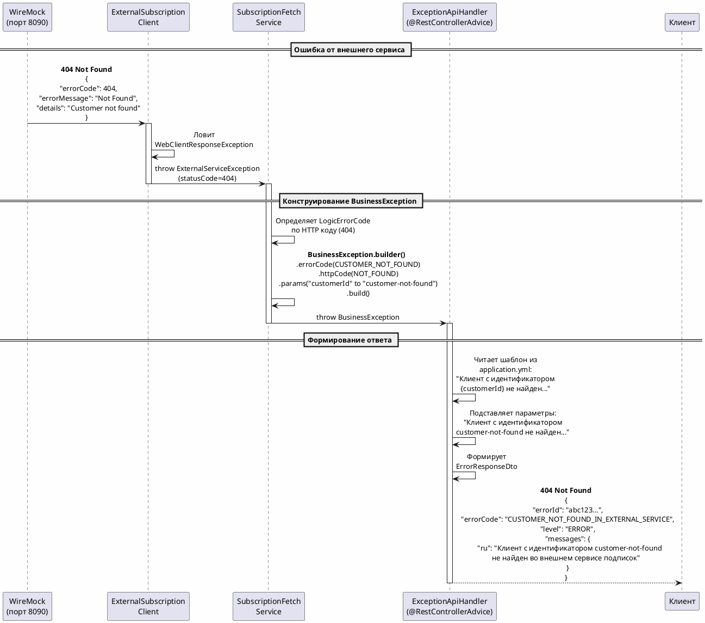

# Финальная архитектура обработки ошибок

## ✅ Реализованная структура

### 1. TypicalException - базовый интерфейс
```kotlin
interface TypicalException {
    fun getType(): String      // Код ошибки
    fun getMessage(): String   // Ключ для Cloud Messages
}
```

### 2. LogicErrorCode - enum с кодами ошибок
```kotlin
enum class LogicErrorCode(private val messageCode: String) : TypicalException {
    INVALID_REQUEST_FETCH_SUBSCRIPTIONS("error.subscription.fetch.invalid.request"),
    FORBIDDEN_ACCESS_SUBSCRIPTIONS("error.subscription.fetch.forbidden"),
    // ...
}
```

### 3. BusinessException - универсальное исключение с Builder
```kotlin
BusinessException.builder()
    .errorCode(LogicErrorCode.CUSTOMER_NOT_FOUND_IN_EXTERNAL_SERVICE)
    .httpCode(HttpStatus.NOT_FOUND)
    .params("customerId" to customerId)
    .logLevel(BusinessException.LogLevel.WARN)
    .cause(ex)
    .build()
```

### 4. Cloud Messages в application.yml
```yaml
# Плоский формат без вложенности
error.subscription.fetch.invalid.request: "Некорректный запрос при получении данных о подписках для пользователя: {customerId}"
error.subscription.fetch.forbidden: "Подписки недоступны для текущего пользователя: {customerId}. Доступ запрещен."
error.subscription.fetch.customer.not.found: "Клиент с идентификатором {customerId} не найден во внешнем сервисе подписок"
```

### 5. ExceptionApiHandler - глобальный обработчик
```kotlin
@RestControllerAdvice
class ExceptionApiHandler(
    private val environment: Environment  // Читает из application.yml
) {
    @ExceptionHandler(BusinessException::class)
    fun handleBusinessException(ex: BusinessException): ResponseEntity<ErrorResponseDto> {
        val messageTemplate = environment.getProperty(ex.logicErrorCode.getMessage())
        val messageRu = substituteParams(messageTemplate, ex.params)
        // ...
    }
}
```

---

## 🔄 Поток обработки ошибки



---

## 📝 Примеры использования

### В сервисе - конструирование BusinessException

```kotlin
// Обработка ошибки от внешнего сервиса
private fun handleExternalServiceError(
    ex: ExternalServiceException,
    customerId: String
): BusinessException {
    val (errorCode, httpStatus) = when (ex.statusCode) {
        400 -> LogicErrorCode.INVALID_REQUEST_FETCH_SUBSCRIPTIONS to HttpStatus.BAD_REQUEST
        403 -> LogicErrorCode.FORBIDDEN_ACCESS_SUBSCRIPTIONS to HttpStatus.FORBIDDEN
        404 -> LogicErrorCode.CUSTOMER_NOT_FOUND_IN_EXTERNAL_SERVICE to HttpStatus.NOT_FOUND
        409 -> LogicErrorCode.SUBSCRIPTIONS_TEMPORARILY_UNAVAILABLE to HttpStatus.CONFLICT
        500 -> LogicErrorCode.EXTERNAL_SERVICE_INTERNAL_ERROR to HttpStatus.INTERNAL_SERVER_ERROR
        else -> LogicErrorCode.UNKNOWN_EXTERNAL_SERVICE_ERROR to HttpStatus.BAD_GATEWAY
    }
    
    return BusinessException.builder()
        .errorCode(errorCode)
        .httpCode(httpStatus)
        .params("customerId" to customerId)  // ✅ Параметры для подстановки
        .logLevel(BusinessException.LogLevel.WARN)
        .cause(ex)
        .build()
}
```

### В контроллере - выброс BusinessException

```kotlin
@GetMapping
suspend fun getCustomerSubscriptions(
    @RequestHeader(value = "AUTH-USER-ID", required = false) customerId: String?
): ResponseEntity<SubscriptionListResponseDto> {
    if (customerId.isNullOrBlank()) {
        throw BusinessException.builder()
            .errorCode(LogicErrorCode.MISSING_AUTH_USER_ID_HEADER)
            .httpCode(HttpStatus.BAD_REQUEST)
            .params("headerName" to "AUTH-USER-ID")  // ✅ Параметр для подстановки
            .logLevel(BusinessException.LogLevel.WARN)
            .build()
    }
    
    return ResponseEntity.ok(subscriptionFetchService.getCustomerSubscriptions(customerId))
}
```

---

## 🎯 Коды ошибок и HTTP статусы

| LogicErrorCode | HTTP | Сообщение с параметром |
|----------------|------|------------------------|
| INVALID_REQUEST_FETCH_SUBSCRIPTIONS | 400 | {customerId} |
| FORBIDDEN_ACCESS_SUBSCRIPTIONS | 403 | {customerId} |
| CUSTOMER_NOT_FOUND_IN_EXTERNAL_SERVICE | 404 | {customerId} |
| SUBSCRIPTIONS_TEMPORARILY_UNAVAILABLE | 409 | {customerId} |
| EXTERNAL_SERVICE_INTERNAL_ERROR | 500 | {customerId} |
| UNKNOWN_EXTERNAL_SERVICE_ERROR | 502 | {customerId} |
| MISSING_AUTH_USER_ID_HEADER | 400 | {headerName} |
| UNEXPECTED_ERROR | 500 | {customerId}, {details} |

---

## 🧪 Тестирование

### 404 Not Found
```bash
curl -H "AUTH-USER-ID: customer-not-found" http://localhost:8080/api/subscriptions/fetch
```

**Ответ:**
```json
{
  "errorId": "6911cd5ea6fec4b2ea2fd6589cc7f40b",
  "errorCode": "CUSTOMER_NOT_FOUND_IN_EXTERNAL_SERVICE",
  "level": "ERROR",
  "messages": {
    "ru": "Клиент с идентификатором customer-not-found не найден во внешнем сервисе подписок"
  }
}
```

### Отсутствие заголовка
```bash
curl http://localhost:8080/api/subscriptions/fetch
```

**Ответ:**
```json
{
  "errorId": "abc...",
  "errorCode": "MISSING_AUTH_USER_ID_HEADER",
  "level": "ERROR",
  "messages": {
    "ru": "Отсутствует обязательный заголовок: AUTH-USER-ID для получения подписок"
  }
}
```

---

## 📂 Структура файлов

```
src/main/kotlin/.../
├── exception/
│   ├── TypicalException.kt              # Интерфейс
│   ├── LogicErrorCode.kt                # Enum с кодами
│   ├── BusinessException.kt             # Универсальное исключение + Builder
│   └── ExceptionApiHandler.kt           # @RestControllerAdvice
│
├── domain/service/subscriptionfetch/
│   └── SubscriptionFetchService.kt      # Конструирует BusinessException
│
└── domain/controller/subscriptionfetch/
    └── SubscriptionFetchController.kt   # Выбрасывает BusinessException

src/main/resources/
└── application.yml                      # Cloud Messages (плоский формат)
```

---

## ✅ Преимущества реализации

1. **Cloud Messages** - централизованное хранилище в application.yml
2. **Параметризация** - динамическая подстановка через `{paramName}`
3. **Builder Pattern** - удобное конструирование исключений
4. **TypicalException** - единый интерфейс для всех типов ошибок
5. **LogLevel** - контроль уровня логирования (ERROR/WARN/INFO)
6. **Environment** - нативная работа Spring с properties
7. **@RestControllerAdvice** - глобальная обработка в одном месте

---

## 🔧 Как добавить новую ошибку

### Шаг 1: Добавить в LogicErrorCode
```kotlin
NEW_ERROR_CODE("error.new.error.message")
```

### Шаг 2: Добавить сообщение в application.yml
```yaml
error.new.error.message: "Новое сообщение с параметром: {paramName}"
```

### Шаг 3: Использовать в коде
```kotlin
throw BusinessException.builder()
    .errorCode(LogicErrorCode.NEW_ERROR_CODE)
    .httpCode(HttpStatus.BAD_REQUEST)
    .params("paramName" to "value")
    .build()
```

Готово! ✅

---

**Дата:** 2025-11-10  
**Статус:** ✅ Реализовано  
**Паттерн:** Cloud Messages + Builder + @RestControllerAdvice

