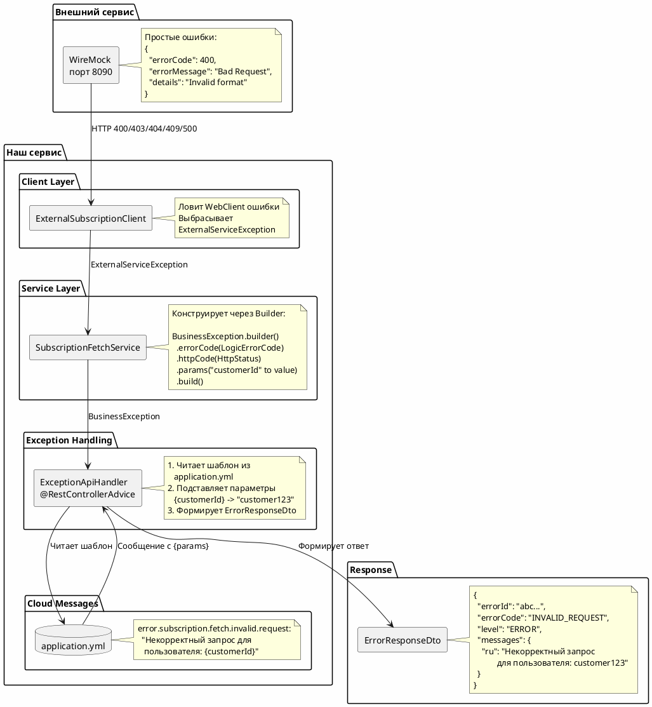

# Структура обработки ошибок

## Концепция Cloud Messages

Система использует паттерн **Cloud Messages** - централизованное хранение сообщений об ошибках с параметризацией.

---

## Архитектура обработки ошибок



---

## Коды ошибок и сообщения

### 400 Bad Request
**Код:** `INVALID_REQUEST_FETCH_SUBSCRIPTIONS`  
**Сообщение:** "Некорректный запрос при получении данных о подписках для пользователя: {customerId}"  
**Когда:** Неверный формат запроса к внешнему сервису

### 403 Forbidden
**Код:** `FORBIDDEN_ACCESS_SUBSCRIPTIONS`  
**Сообщение:** "Подписки недоступны для текущего пользователя: {customerId}. Доступ запрещен."  
**Когда:** Нет прав доступа к подпискам пользователя

### 404 Not Found
**Код:** `CUSTOMER_NOT_FOUND_IN_EXTERNAL_SERVICE`  
**Сообщение:** "Клиент с идентификатором {customerId} не найден во внешнем сервисе подписок"  
**Когда:** Клиент не существует во внешней системе

### 409 Conflict
**Код:** `SUBSCRIPTIONS_TEMPORARILY_UNAVAILABLE`  
**Сообщение:** "Подписки для пользователя {customerId} временно недоступны. Повторите запрос позже."  
**Когда:** Временные проблемы с доступностью подписок

### 500 Internal Server Error
**Код:** `EXTERNAL_SERVICE_INTERNAL_ERROR`  
**Сообщение:** "Внутренняя ошибка внешнего сервиса при получении подписок для пользователя: {customerId}"  
**Когда:** Сбой внешнего сервиса

### Неизвестная ошибка
**Код:** `UNKNOWN_EXTERNAL_SERVICE_ERROR`  
**HTTP:** 502 Bad Gateway  
**Сообщение:** "Неизвестная ошибка внешнего сервиса при получении подписок для пользователя: {customerId}"  
**Когда:** Любой другой код ошибки

---

## Примеры использования

### Пример 1: Успешный запрос
```bash
curl -H "AUTH-USER-ID: customer-success" http://localhost:8080/api/subscriptions/fetch
```

**Response 200 OK:**
```json
{
  "subscriptions": [...],
  "total": 3,
  "message": "Подписки успешно получены"
}
```

### Пример 2: Клиент не найден
```bash
curl -H "AUTH-USER-ID: customer-not-found" http://localhost:8080/api/subscriptions/fetch
```

**Response 404 Not Found:**
```json
{
  "errorId": "abc123...",
  "errorCode": "CUSTOMER_NOT_FOUND_IN_EXTERNAL_SERVICE",
  "level": "ERROR",
  "messages": {
    "ru": "Клиент с идентификатором customer-not-found не найден во внешнем сервисе подписок"
  }
}
```

### Пример 3: Отсутствует заголовок
```bash
curl http://localhost:8080/api/subscriptions/fetch
```

**Response 400 Bad Request:**
```json
{
  "errorId": "def456...",
  "errorCode": "MISSING_AUTH_USER_ID_HEADER",
  "level": "ERROR",
  "messages": {
    "ru": "Отсутствует обязательный заголовок: AUTH-USER-ID для получения подписок"
  }
}
```

---

## Преимущества подхода

### 1. Централизация сообщений
- Все сообщения в одном месте (enum)
- Легко изменить текст для всех мест использования
- Контроль консистентности

### 2. Параметризация
- Динамическая подстановка параметров (customerId, publicId и т.д.)
- Персонализированные сообщения для клиента
- Контекстная информация в ошибках

### 3. Типобезопасность
- Kotlin enum исключает опечатки в кодах ошибок
- Компиляция не пройдёт при неверном использовании
- IDE подсказывает доступные типы ошибок

### 4. Удобство для клиента
- Структурированный формат ответа
- Уникальный errorId для трейсинга
- Понятные сообщения на русском языке
- Машиночитаемый errorCode для автоматизации

### 5. Разделение ответственности
- WireMock возвращает простые технические ошибки
- Наш сервис обогащает их понятными сообщениями
- Клиент получает user-friendly ответы

---

## Структура файлов

```
src/main/kotlin/.../domain/
├── dto/subscriptionfetch/
│   └── ErrorResponseDto.kt           # Структура ответа с ошибкой
├── service/subscriptionfetch/
│   ├── SubscriptionFetchErrorType.kt # Enum с типами ошибок (Cloud Messages)
│   ├── SubscriptionFetchException.kt # Исключение с типом ошибки
│   └── SubscriptionFetchService.kt   # Конструирование исключений
└── controller/subscriptionfetch/
    └── SubscriptionFetchController.kt # Формирование ErrorResponseDto

src/main/resources/wiremock/responses/
├── error-400.json                    # Простые ошибки от WireMock
├── error-403.json
├── error-404.json
├── error-409.json
└── error-500.json
```

---

## Как добавить новую ошибку

### Шаг 1: Добавить в enum
```kotlin
enum class SubscriptionFetchErrorType {
    // ...
    NEW_ERROR(
        code = "NEW_ERROR_CODE",
        httpStatus = 422,
        messageTemplate = { customerId -> 
            "Новое сообщение об ошибке для пользователя: $customerId"
        }
    )
}
```

### Шаг 2: Создать JSON для WireMock (если нужно)
```json
{
  "errorCode": 422,
  "errorMessage": "Unprocessable Entity",
  "details": "Technical details"
}
```

### Шаг 3: Настроить стаб в WireMockStubsConfig
```kotlin
wireMockServer.stubFor(
    get(urlPathEqualTo("/api/external/subscriptions"))
        .withQueryParam("customerId", equalTo("customer-new-error"))
        .willReturn(aResponse()
            .withStatus(422)
            .withBody(loadJsonFromFile("error-422.json")))
)
```

Готово! Enum автоматически обработает новую ошибку.

---

**Дата:** 2025-11-10  
**Паттерн:** Cloud Messages  
**Статус:** ✅ Реализовано


