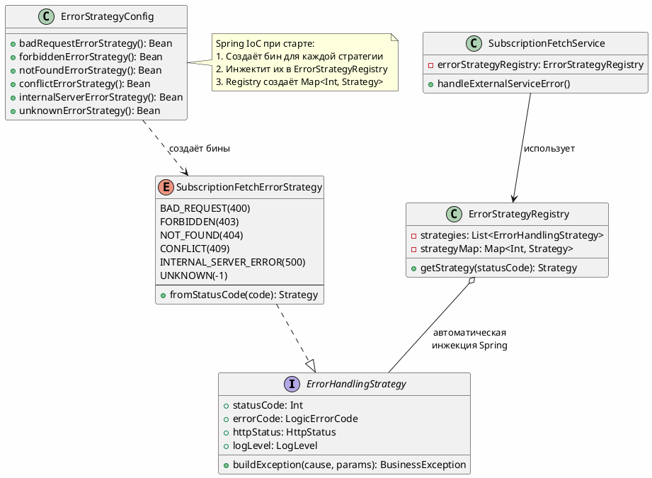
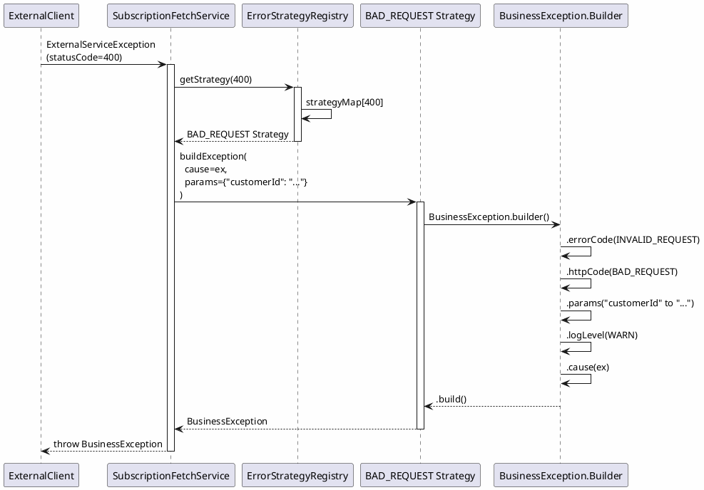

# Паттерн Strategy для обработки ошибок

## 🎯 Архитектура

Используется **паттерн Strategy** + **Spring IoC** для универсальной обработки ошибок.

---

## 📐 Компоненты архитектуры



---

## 🔄 Как это работает

### 1. Enum со стратегиями

```kotlin
enum class SubscriptionFetchErrorStrategy(
    override val statusCode: Int,
    override val errorCode: LogicErrorCode,
    override val httpStatus: HttpStatus,
    override val logLevel: BusinessException.LogLevel = BusinessException.LogLevel.WARN
) : ErrorHandlingStrategy {
    
    BAD_REQUEST(400, LogicErrorCode.INVALID_REQUEST_FETCH_SUBSCRIPTIONS, HttpStatus.BAD_REQUEST),
    FORBIDDEN(403, LogicErrorCode.FORBIDDEN_ACCESS_SUBSCRIPTIONS, HttpStatus.FORBIDDEN),
    NOT_FOUND(404, LogicErrorCode.CUSTOMER_NOT_FOUND_IN_EXTERNAL_SERVICE, HttpStatus.NOT_FOUND),
    // ...
    
    // Метод построения BusinessException реализован в интерфейсе
}
```

### 2. Configuration регистрирует бины

```kotlin
@Configuration
class ErrorStrategyConfig {
    
    @Bean
    fun badRequestErrorStrategy(): ErrorHandlingStrategy {
        return SubscriptionFetchErrorStrategy.BAD_REQUEST
    }
    
    @Bean
    fun forbiddenErrorStrategy(): ErrorHandlingStrategy {
        return SubscriptionFetchErrorStrategy.FORBIDDEN
    }
    
    // ... остальные стратегии
}
```

**При старте Spring:**
1. Видит аннотацию `@Configuration`
2. Вызывает все методы с `@Bean`
3. Регистрирует возвращаемые объекты как бины в ApplicationContext

### 3. Registry автоматически получает все стратегии

```kotlin
@Component
class ErrorStrategyRegistry(
    private val strategies: List<ErrorHandlingStrategy>  // ✅ Spring автоматически инжектит ВСЕ бины
) {
    private val strategyMap: Map<Int, ErrorHandlingStrategy>
    
    init {
        // Создаём мапу: HTTP код -> стратегия
        strategyMap = strategies
            .filter { it.statusCode != -1 }
            .associateBy { it.statusCode }
    }
    
    fun getStrategy(statusCode: Int): ErrorHandlingStrategy {
        return strategyMap[statusCode] ?: defaultStrategy
    }
}
```

**Магия Spring IoC:**
- Spring видит конструктор с параметром `List<ErrorHandlingStrategy>`
- Автоматически находит ВСЕ бины типа `ErrorHandlingStrategy`
- Инжектит их как список

### 4. Сервис использует Registry

```kotlin
@Service
class SubscriptionFetchService(
    private val errorStrategyRegistry: ErrorStrategyRegistry  // ✅ Spring инжектит
) {
    
    private fun handleExternalServiceError(
        ex: ExternalServiceException,
        customerId: String
    ): BusinessException {
        // Получаем нужную стратегию
        val strategy = errorStrategyRegistry.getStrategy(ex.statusCode)
        
        // Стратегия сама знает как построить BusinessException
        return strategy.buildException(
            cause = ex,
            params = mapOf("customerId" to customerId)
        )
    }
}
```

**Было 60+ строк кода with when { } → Стало 5 строк!**

---

## 🎯 Преимущества паттерна

### 1. **Разделение ответственности (SRP)**
Каждая стратегия знает только о своей ошибке:
```kotlin
BAD_REQUEST -> знает только про 400
FORBIDDEN -> знает только про 403
```

### 2. **Open/Closed Principle**
Добавление новой ошибки:
```kotlin
// Добавляем в enum
TOO_MANY_REQUESTS(429, LogicErrorCode.TOO_MANY_REQUESTS, HttpStatus.TOO_MANY_REQUESTS)

// Добавляем бин в Config
@Bean
fun tooManyRequestsErrorStrategy(): ErrorHandlingStrategy {
    return SubscriptionFetchErrorStrategy.TOO_MANY_REQUESTS
}
```

Сервис **не меняется!**

### 3. **Spring IoC автоматизация**
- Не нужен ручной `new ErrorStrategyRegistry(...)`
- Spring сам соберёт все стратегии
- Автоматическое обновление при добавлении новых бинов

### 4. **Тестируемость**
Легко мокировать:
```kotlin
@Test
fun testErrorHandling() {
    val mockStrategy = mockk<ErrorHandlingStrategy>()
    val mockRegistry = ErrorStrategyRegistry(listOf(mockStrategy))
    val service = SubscriptionFetchService(client, mockRegistry)
    // ...
}
```

### 5. **Переиспользуемость**
Можно использовать для других сервисов:
```kotlin
enum class PaymentErrorStrategy(...) : ErrorHandlingStrategy { }
enum class OrderErrorStrategy(...) : ErrorHandlingStrategy { }
```

---

## 📊 Последовательность работы



---

## 🧪 Как добавить новую ошибку

### Шаг 1: Добавить в LogicErrorCode
```kotlin
enum class LogicErrorCode(...) {
    NEW_ERROR_CODE("error.new.error.message")
}
```

### Шаг 2: Добавить сообщение в application.yml
```yaml
error.new.error.message: "Новое сообщение для {customerId}"
```

### Шаг 3: Добавить в SubscriptionFetchErrorStrategy
```kotlin
enum class SubscriptionFetchErrorStrategy(...) {
    NEW_ERROR(
        statusCode = 418,
        errorCode = LogicErrorCode.NEW_ERROR_CODE,
        httpStatus = HttpStatus.I_AM_A_TEAPOT
    )
}
```

### Шаг 4: Зарегистрировать бин в Config
```kotlin
@Configuration
class ErrorStrategyConfig {
    @Bean
    fun newErrorStrategy(): ErrorHandlingStrategy {
        return SubscriptionFetchErrorStrategy.NEW_ERROR
    }
}
```

### Шаг 5: Готово! ✅

Spring автоматически:
1. Создаст бин при старте
2. Инжектит его в ErrorStrategyRegistry
3. Registry добавит в Map<418, NEW_ERROR>
4. Сервис будет использовать автоматически

**Никаких изменений в SubscriptionFetchService!**

---

## 📝 Структура файлов

```
src/main/kotlin/.../
├── exception/
│   ├── strategy/
│   │   ├── ErrorHandlingStrategy.kt            # Интерфейс стратегии
│   │   ├── SubscriptionFetchErrorStrategy.kt   # Enum со стратегиями
│   │   └── ErrorStrategyRegistry.kt            # Реестр (Spring @Component)
│   │
│   ├── TypicalException.kt
│   ├── LogicErrorCode.kt
│   ├── BusinessException.kt
│   └── ExceptionApiHandler.kt
│
├── config/
│   └── ErrorStrategyConfig.kt                   # Spring @Configuration с @Bean
│
└── domain/service/subscriptionfetch/
    └── SubscriptionFetchService.kt              # Использует Registry

src/main/resources/
└── application.yml                              # Cloud Messages
```

---

## 🎓 Spring IoC в действии

### Как Spring собирает всё вместе:

1. **Старт приложения**
   ```
   ApplicationContext инициализируется
   ```

2. **Сканирование @Configuration**
   ```
   Находит ErrorStrategyConfig
   Вызывает все методы с @Bean
   Создаёт 6 бинов (BAD_REQUEST, FORBIDDEN, NOT_FOUND, CONFLICT, INTERNAL_SERVER_ERROR, UNKNOWN)
   ```

3. **Сканирование @Component**
   ```
   Находит ErrorStrategyRegistry
   Видит конструктор с List<ErrorHandlingStrategy>
   Ищет ВСЕ бины типа ErrorHandlingStrategy
   Инжектит список из 6 бинов
   ```

4. **Создание @Service**
   ```
   Находит SubscriptionFetchService
   Видит конструктор с ErrorStrategyRegistry
   Инжектит уже созданный бин ErrorStrategyRegistry
   ```

5. **Готово!**
   ```
   Все зависимости разрешены
   Приложение готово к работе
   ```

---

## ✅ Итоговые преимущества

| До | После |
|----|-------|
| 60+ строк when-кода | 5 строк через Registry |
| Hardcoded логика в сервисе | Декларативные стратегии в enum |
| Изменения требуют правки сервиса | Добавление через новый @Bean |
| Сложное тестирование | Легко мокируется |
| Дублирование кода | Единый механизм в интерфейсе |

**Паттерн Strategy + Spring IoC = Чистая архитектура!** 🚀

---

**Дата:** 2025-11-10  
**Статус:** ✅ Реализовано  
**Паттерны:** Strategy + IoC + Registry


