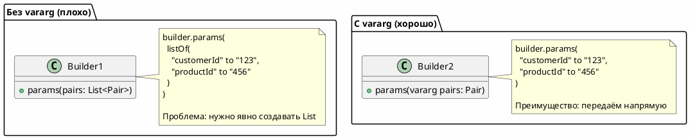
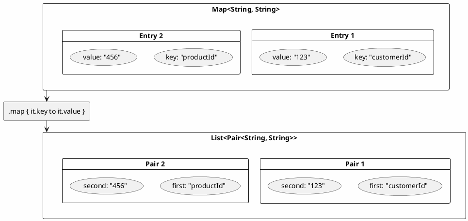
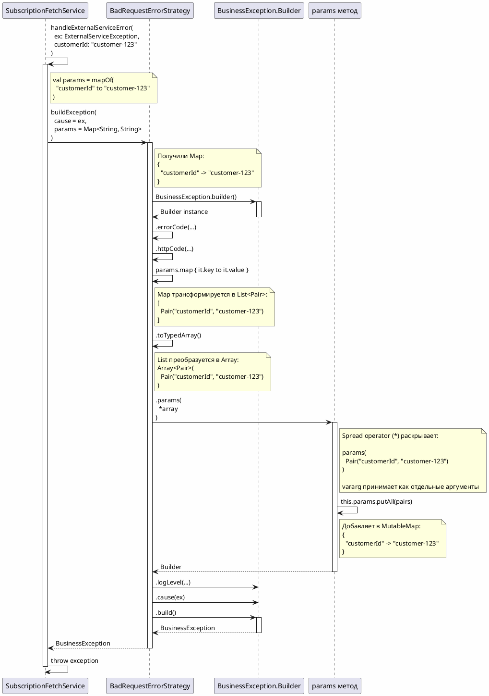

# Kotlin: Vararg, Spread Operator и поток параметров

## 📑 Оглавление

1. [Введение](#введение)
2. [Разбор синтаксиса](#разбор-синтаксиса)
3. [Vararg параметры](#vararg-параметры)
4. [Spread Operator (*)](#spread-operator-)
5. [Map и трансформация коллекций](#map-и-трансформация-коллекций)
6. [Pair и оператор to](#pair-и-оператор-to)
7. [Полный поток параметров](#полный-поток-параметров)
8. [Примеры из проекта](#примеры-из-проекта)

---

## Введение

В проекте используется следующий синтаксис при построении `BusinessException`:

```kotlin
.params(*params.map { it.key to it.value }.toTypedArray())
```

Этот документ объясняет:
- **Что** означает каждая часть синтаксиса
- **Откуда** берутся параметры
- **Как** они проходят через систему

---

## Разбор синтаксиса

### Полная строка

```kotlin
.params(*params.map { it.key to it.value }.toTypedArray())
```

### Разбор по частям

```kotlin
.params(                              // 1. Вызов метода params()
    *                                 // 2. Spread operator (*)
    params                            // 3. Исходная Map<String, String>
    .map { it.key to it.value }       // 4. Преобразование в List<Pair>
    .toTypedArray()                   // 5. Преобразование в Array<Pair>
)
```

---

## Vararg параметры

### Что такое vararg?

**vararg** (variable arguments) - это переменное количество аргументов. Метод может принять 0, 1, 2 или N аргументов.

### Определение метода с vararg

```kotlin
// BusinessException.kt
class Builder {
    private val params: MutableMap<String, Any> = mutableMapOf()
    
    // Метод принимает ПЕРЕМЕННОЕ количество Pair
    fun params(vararg pairs: Pair<String, Any>): Builder {
        this.params.putAll(pairs)  // pairs - это Array<Pair<String, Any>>
        return this
    }
}
```

### Как можно вызывать vararg

```kotlin
// Вызов 1: без параметров
builder.params()

// Вызов 2: один параметр
builder.params("customerId" to "123")

// Вызов 3: несколько параметров
builder.params(
    "customerId" to "123",
    "productId" to "456",
    "orderId" to "789"
)

// Вызов 4: spread operator с массивом
val myArray = arrayOf("customerId" to "123", "productId" to "456")
builder.params(*myArray)  // ← наш случай!
```

### Почему нужен vararg?



---

## Spread Operator (*)

### Что такое Spread Operator?

**Spread operator** (`*`) - оператор "раскрытия" массива. Превращает `Array<T>` в отдельные элементы.

### Зачем нужен?

```kotlin
fun params(vararg pairs: Pair<String, Any>): Builder {
    // vararg ожидает: params(pair1, pair2, pair3)
    // НЕ ожидает:     params(array)
}

val myArray = arrayOf("a" to 1, "b" to 2)

// ❌ ОШИБКА: Type mismatch
builder.params(myArray)

// ✅ ПРАВИЛЬНО: раскрываем массив
builder.params(*myArray)
```

### Визуализация

```
Без spread operator:
builder.params(myArray)
             ↓
    params(Array<Pair>)  ← ОДИН аргумент типа Array
             ❌ Ошибка типа!

С spread operator:
builder.params(*myArray)
             ↓
    params(pair1, pair2, pair3)  ← ТРИ отдельных аргумента
             ✅ Правильно!
```

### Примеры

```kotlin
// Пример 1: функция с vararg
fun printAll(vararg items: String) {
    items.forEach { println(it) }
}

// Вызов без spread
printAll("A", "B", "C")  // ✅ Работает

// Вызов с массивом БЕЗ spread
val array = arrayOf("A", "B", "C")
printAll(array)  // ❌ Ошибка компиляции!

// Вызов с массивом С spread
printAll(*array)  // ✅ Работает
```

```kotlin
// Пример 2: комбинация обычных параметров и spread
val array = arrayOf("B", "C", "D")
printAll("A", *array, "E")  // Результат: A B C D E
```

---

## Map и трансформация коллекций

### Метод map

**map** - трансформирует каждый элемент коллекции.

```kotlin
val numbers = listOf(1, 2, 3)
val doubled = numbers.map { it * 2 }  // [2, 4, 6]
```

### В нашем случае

```kotlin
params.map { it.key to it.value }
```

**Входные данные:** `Map<String, String>`  
**Выходные данные:** `List<Pair<String, String>>`

### Пошаговое выполнение

```kotlin
// Исходная Map
val params = mapOf(
    "customerId" to "123",
    "productId" to "456"
)

// Шаг 1: map перебирает каждую Entry
params.map { entry ->  // it = Entry<String, String>
    entry.key to entry.value  // создаём Pair
}

// Результат: List<Pair<String, String>>
[
    Pair("customerId", "123"),
    Pair("productId", "456")
]
```

### Визуализация map



---

## Pair и оператор to

### Что такое Pair?

**Pair** - это класс для хранения двух связанных значений.

```kotlin
data class Pair<out A, out B>(
    val first: A,
    val second: B
)
```

### Оператор to

**to** - это infix функция для создания Pair.

```kotlin
// Определение в Kotlin Standard Library
infix fun <A, B> A.to(that: B): Pair<A, B> = Pair(this, that)

// Использование
val pair1 = Pair("key", "value")  // Обычный способ
val pair2 = "key" to "value"      // С оператором to (то же самое!)
```

### Примеры

```kotlin
// Способ 1: конструктор
val pair1 = Pair("customerId", "123")
println(pair1.first)   // customerId
println(pair1.second)  // 123

// Способ 2: оператор to (более читаемо)
val pair2 = "customerId" to "123"
println(pair2.first)   // customerId
println(pair2.second)  // 123

// Деструктуризация
val (key, value) = "customerId" to "123"
println(key)    // customerId
println(value)  // 123
```

---

## Полный поток параметров

### Визуализация потока



### Пошаговое прохождение

#### Шаг 1: Создание Map в сервисе

```kotlin
// SubscriptionFetchService.kt
private fun handleExternalServiceError(
    ex: ExternalServiceException,
    customerId: String
): BusinessException {
    // Подготавливаем полный контекст для стратегий
    // Каждая стратегия сама решит, какие параметры использовать
    val contextParams = mapOf(
        "customerId" to customerId,
        "statusCode" to ex.statusCode.toString(),
        "statusMessage" to ex.statusMessage,
        "responseBody" to ex.responseBody
    )
    
    val strategy = errorStrategyMap[ex.statusCode]
    
    return strategy.buildException(
        cause = ex,
        params = contextParams  // ← Передаём полный контекст
    )
}
```

**Результат:** 
```kotlin
Map<String, String> = {
    "customerId" -> "customer-123",
    "statusCode" -> "400",
    "statusMessage" -> "Bad Request",
    "responseBody" -> "{\"errorCode\":400,...}"
}
```

**Зачем передавать все параметры?**
- Разные ошибки используют разные параметры в сообщениях
- Например: `{customerId}`, `{customerId} {details}`, `{statusMessage}`
- Каждая стратегия выбирает только нужные ей параметры

#### Шаг 2: Передача в стратегию

```kotlin
// ErrorHandlingStrategy.kt (интерфейс)
interface ErrorHandlingStrategy {
    fun buildException(
        cause: Throwable, 
        params: Map<String, String>  // ← Получаем Map
    ): BusinessException
}
```

#### Шаг 3: Реализация в стратегии

```kotlin
// BadRequestErrorStrategy.kt
override fun buildException(
    cause: Throwable, 
    params: Map<String, String>  // ← params = {"customerId" -> "customer-123"}
): BusinessException {
    return BusinessException.builder()
        .errorCode(LogicErrorCode.INVALID_REQUEST_FETCH_SUBSCRIPTIONS)
        .httpCode(HttpStatus.BAD_REQUEST)
        .params(*params.map { it.key to it.value }.toTypedArray())  // ← Здесь!
        .logLevel(BusinessException.LogLevel.WARN)
        .cause(cause)
        .build()
}
```

#### Шаг 4: Трансформация Map → List

```kotlin
params.map { it.key to it.value }
```

**Вход:** `Map<String, String> = {"customerId" -> "customer-123"}`  
**Выход:** `List<Pair<String, String>> = [Pair("customerId", "customer-123")]`

#### Шаг 5: Преобразование List → Array

```kotlin
.toTypedArray()
```

**Вход:** `List<Pair<String, String>>`  
**Выход:** `Array<Pair<String, String>>`

#### Шаг 6: Spread operator

```kotlin
.params(*array)
```

**Раскрывает:** `Array<Pair>` → отдельные `Pair` аргументы

**Эквивалентно:**
```kotlin
// Без spread (то что мы имеем):
val array = arrayOf(Pair("customerId", "customer-123"))
.params(*array)

// С spread (что получается):
.params(Pair("customerId", "customer-123"))

// Или ещё проще (что видит vararg):
.params("customerId" to "customer-123")
```

#### Шаг 7: Метод params в Builder

```kotlin
// BusinessException.kt
class Builder {
    private val params: MutableMap<String, Any> = mutableMapOf()
    
    fun params(vararg pairs: Pair<String, Any>): Builder {
        this.params.putAll(pairs)  // ← Добавляет все пары в Map
        return this
    }
}
```

**Результат:** `params = {"customerId" -> "customer-123"}` сохранены в Builder

---

## Примеры из проекта

### Пример 1: BadRequestErrorStrategy

```kotlin
// src/main/kotlin/.../exception/strategy/impl/BadRequestErrorStrategy.kt
@Component
class BadRequestErrorStrategy(
    private val properties: ErrorStrategiesProperties
) : ErrorHandlingStrategy {
    
    override fun getStatusCode(): Int = properties.badRequest
    
    override fun buildException(
        cause: Throwable, 
        params: Map<String, String>  // ← Откуда: из SubscriptionFetchService
    ): BusinessException {
        return BusinessException.builder()
            .errorCode(LogicErrorCode.INVALID_REQUEST_FETCH_SUBSCRIPTIONS)
            .httpCode(HttpStatus.BAD_REQUEST)
            .params(*params.map { it.key to it.value }.toTypedArray())  // ← Трансформация
            .logLevel(BusinessException.LogLevel.WARN)
            .cause(cause)
            .build()
    }
}
```

**Откуда параметры:**
```
SubscriptionFetchService
  ↓ mapOf("customerId" to customerId)
BadRequestErrorStrategy.buildException(params)
  ↓ params.map {...}.toTypedArray()
BusinessException.Builder.params(*array)
  ↓ this.params.putAll(pairs)
BusinessException с params = {"customerId" -> "customer-123"}
```

### Пример 2: Вызов из сервиса

```kotlin
// src/main/kotlin/.../service/subscriptionfetch/SubscriptionFetchService.kt
@Service
class SubscriptionFetchService(
    private val externalClient: ExternalSubscriptionClient,
    private val errorStrategyMap: Map<Int, ErrorHandlingStrategy>
) {
    suspend fun getCustomerSubscriptions(customerId: String): SubscriptionListResponseDto {
        try {
            return externalClient.fetchSubscriptions(customerId)
        } catch (ex: ExternalServiceException) {
            throw handleExternalServiceError(ex, customerId)
        }
    }
    
    private fun handleExternalServiceError(
        ex: ExternalServiceException,
        customerId: String  // ← Исходный параметр из метода
    ): BusinessException {
        val strategy = errorStrategyMap[ex.statusCode]
        
        return if (strategy != null) {
            strategy.buildException(
                cause = ex,
                params = mapOf("customerId" to customerId)  // ← Создаём Map
            )
        } else {
            BusinessException.builder()
                .errorCode(LogicErrorCode.UNKNOWN_EXTERNAL_SERVICE_ERROR)
                .httpCode(HttpStatus.BAD_GATEWAY)
                .params("customerId" to customerId)  // ← Прямой вызов vararg
                .logLevel(BusinessException.LogLevel.WARN)
                .cause(ex)
                .build()
        }
    }
}
```

### Пример 3: Выбор конкретных параметров

```kotlin
// Стратегия использует ВСЕ параметры
override fun buildException(
    cause: Throwable, 
    params: Map<String, String>
): BusinessException {
    // params = {
    //   "customerId" -> "123",
    //   "statusCode" -> "400",
    //   "statusMessage" -> "Bad Request",
    //   "responseBody" -> "{...}"
    // }
    
    return BusinessException.builder()
        .errorCode(LogicErrorCode.INVALID_REQUEST_FETCH_SUBSCRIPTIONS)
        .httpCode(HttpStatus.BAD_REQUEST)
        .params(*params.map { it.key to it.value }.toTypedArray())  // Все параметры
        .build()
}
```

```kotlin
// Стратегия использует ТОЛЬКО НУЖНЫЕ параметры
override fun buildException(
    cause: Throwable, 
    params: Map<String, String>
): BusinessException {
    // Для этой ошибки нужен только customerId
    return BusinessException.builder()
        .errorCode(LogicErrorCode.INVALID_REQUEST_FETCH_SUBSCRIPTIONS)
        .httpCode(HttpStatus.BAD_REQUEST)
        .params("customerId" to params["customerId"]!!)  // Только customerId
        .build()
}
```

```kotlin
// Стратегия добавляет свои параметры
override fun buildException(
    cause: Throwable, 
    params: Map<String, String>
): BusinessException {
    // Берём customerId и добавляем details из responseBody
    return BusinessException.builder()
        .errorCode(LogicErrorCode.UNEXPECTED_ERROR)
        .httpCode(HttpStatus.INTERNAL_SERVER_ERROR)
        .params(
            "customerId" to params["customerId"]!!,
            "details" to params["responseBody"]!!  // Добавили details
        )
        .build()
}
```

---

## Альтернативные подходы

### Вариант 1: Прямая передача (текущий)

```kotlin
.params(*params.map { it.key to it.value }.toTypedArray())
```

**Плюсы:**
- Универсальный (работает с любым количеством параметров)
- Компактный (одна строка)

**Минусы:**
- Не очень читаемый для новичков
- Лишние аллокации (создаём List, потом Array)

### Вариант 2: Добавить перегрузку метода

```kotlin
// В Builder можно добавить:
fun params(params: Map<String, Any>): Builder {
    this.params.putAll(params)
    return this
}

// Тогда в стратегии:
.params(params)  // Просто передаём Map напрямую!
```

**Плюсы:**
- Более читаемо
- Нет лишних трансформаций

**Минусы:**
- Нужно добавить новый метод в Builder

### Вариант 3: Entries

```kotlin
.params(*params.entries.map { it.toPair() }.toTypedArray())
```

### Вариант 4: toList()

```kotlin
.params(*params.toList().toTypedArray())
```

**Map.toList()** возвращает `List<Pair<K, V>>`, поэтому это самый короткий вариант!

```kotlin
// Лучший вариант:
.params(*params.toList().toTypedArray())
```

---

## Заключение

### Полная цепочка

```
1. SubscriptionFetchService получает customerId: String

2. Создаёт Map<String, String>:
   mapOf("customerId" to customerId)

3. Передаёт в ErrorHandlingStrategy.buildException(params)

4. Стратегия трансформирует Map → List<Pair>:
   params.map { it.key to it.value }

5. Преобразует List → Array:
   .toTypedArray()

6. Раскрывает Array через spread operator:
   .params(*array)

7. vararg метод получает отдельные Pair аргументы:
   params(pair1, pair2, ...)

8. Добавляет их в MutableMap:
   this.params.putAll(pairs)

9. BusinessException создаётся с этими параметрами
```

### Ключевые концепции

| Концепция | Описание |
|-----------|----------|
| **vararg** | Переменное количество аргументов |
| **Spread operator (*)** | Раскрытие массива в отдельные элементы |
| **map** | Трансформация коллекции |
| **Pair** | Класс для хранения двух значений |
| **to** | Infix оператор для создания Pair |
| **toTypedArray()** | Преобразование List в Array |

---

**Дата:** 2025-11-12  
**Версия:** 1.0  
**Язык:** Kotlin

