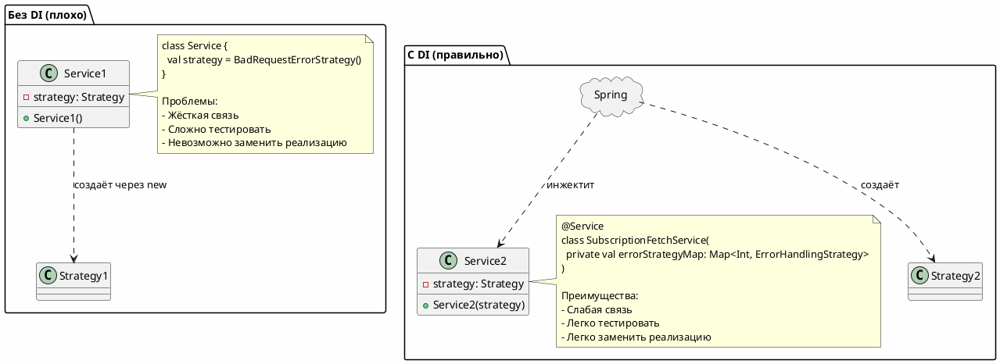
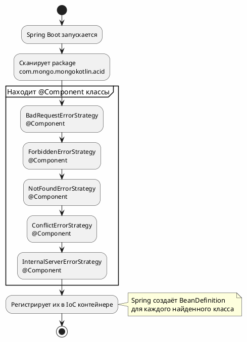
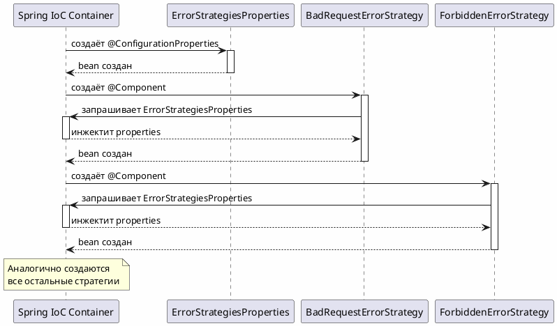
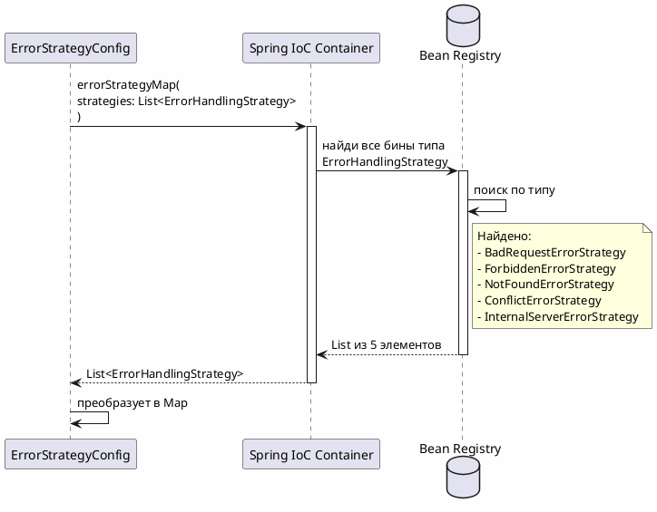
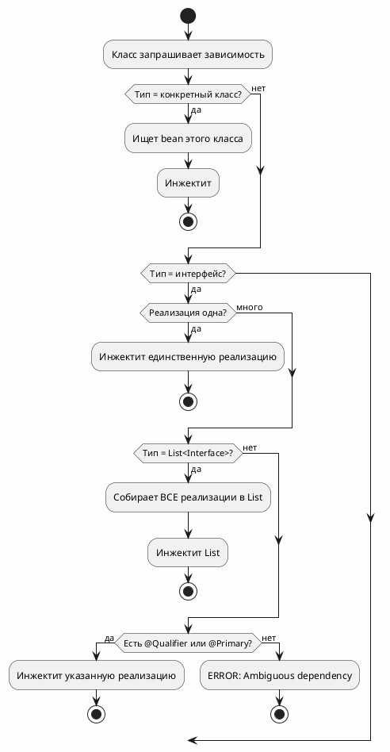
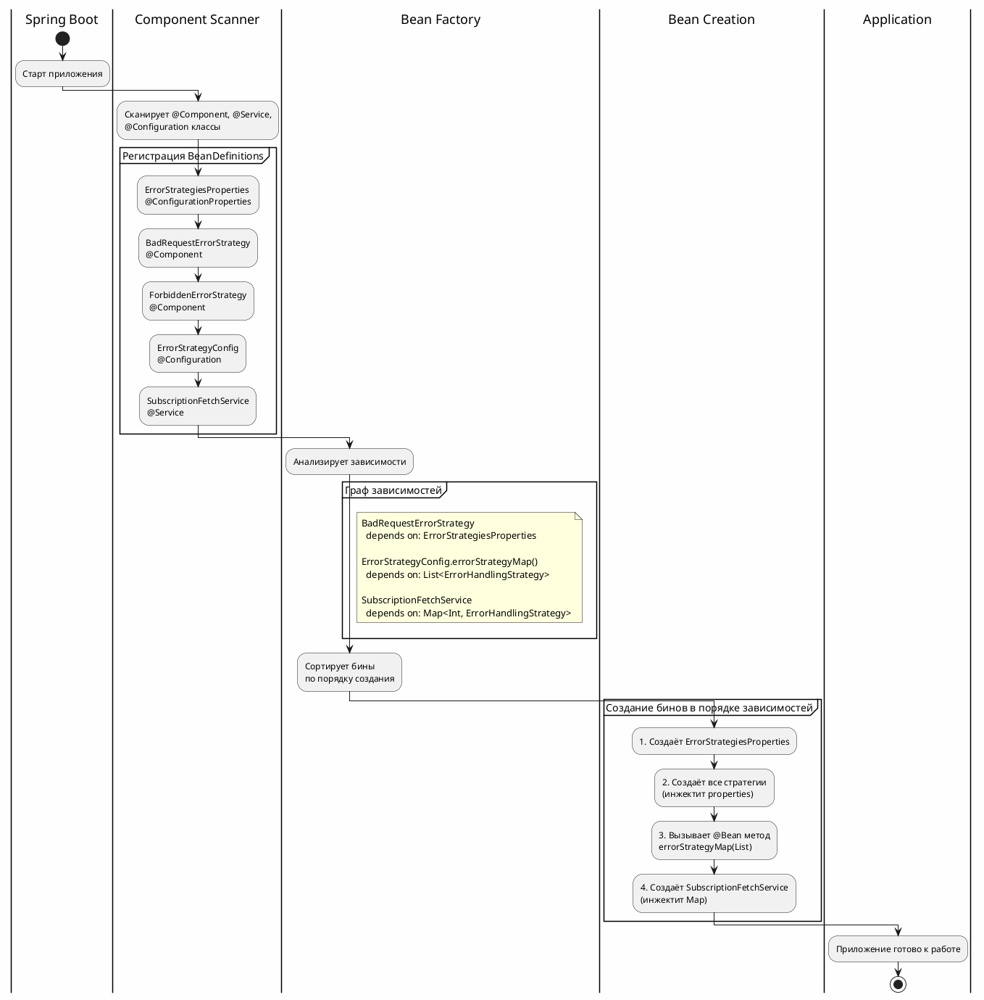

# Spring DI: Механизм Multi-Implementation

## 📑 Оглавление

1. [Введение](#введение)
2. [Основы Dependency Injection](#основы-dependency-injection)
3. [Multi-Implementation в Spring](#multi-implementation-в-spring)
4. [Механизм работы Spring IoC](#механизм-работы-spring-ioc)
5. [Примеры из проекта](#примеры-из-проекта)
6. [Как Spring понимает что инжектить](#как-spring-понимает-что-инжектить)
7. [Жизненный цикл бинов](#жизненный-цикл-бинов)

---

## Введение

В нашем проекте используется паттерн **Multi-Implementation** - когда один интерфейс имеет несколько реализаций, и Spring автоматически находит их все и предоставляет в нужном месте.

**Пример из проекта:**
- 1 интерфейс: `ErrorHandlingStrategy`
- 5 реализаций: `BadRequestErrorStrategy`, `ForbiddenErrorStrategy`, `NotFoundErrorStrategy`, `ConflictErrorStrategy`, `InternalServerErrorStrategy`

---

## Основы Dependency Injection

### Что такое DI?

**Dependency Injection (DI)** - это когда фреймворк сам создаёт объекты и внедряет зависимости, вместо того чтобы вы создавали их через `new`.



---

## Multi-Implementation в Spring

### Проблема

У нас есть **один интерфейс** и **много реализаций**:

```kotlin
// Интерфейс
interface ErrorHandlingStrategy {
    fun getStatusCode(): Int
    fun buildException(cause: Throwable, params: Map<String, String>): BusinessException
}

// Реализация 1
@Component
class BadRequestErrorStrategy : ErrorHandlingStrategy {
    override fun getStatusCode(): Int = 400
    // ...
}

// Реализация 2
@Component
class ForbiddenErrorStrategy : ErrorHandlingStrategy {
    override fun getStatusCode(): Int = 403
    // ...
}

// ... еще 3 реализации
```

**Вопрос:** Как Spring поймёт, какую реализацию нужно инжектить?

### Решение: List и Map

Spring умеет инжектить **ВСЕ реализации** как коллекцию:

```kotlin
// ❌ Так НЕ РАБОТАЕТ - Spring не знает какую выбрать
@Service
class MyService(
    private val strategy: ErrorHandlingStrategy  // Какую из 5 выбрать?
)

// ✅ Так РАБОТАЕТ - Spring инжектит все реализации
@Service
class MyService(
    private val strategies: List<ErrorHandlingStrategy>  // Все 5 стратегий!
)
```

---

## Механизм работы Spring IoC

### Шаг 1: Сканирование компонентов

При старте приложения Spring сканирует все классы с аннотациями.



### Шаг 2: Создание бинов

Spring создаёт экземпляры (бины) всех найденных классов.



### Шаг 3: Инжекция как Set

Когда какой-то класс запрашивает `Set<ErrorHandlingStrategy>`, Spring находит **ВСЕ** бины этого типа и гарантирует их уникальность.

```kotlin
@Configuration
class ErrorStrategyConfig {
    
    @Bean
    fun errorStrategyMap(
        strategies: Set<ErrorHandlingStrategy>  // ← Spring инжектит ВСЕ реализации как Set
    ): Map<Int, ErrorHandlingStrategy> {
        // Spring автоматически нашёл все 5 стратегий
        // и передал их как Set (гарантирована уникальность)
    }
}
```

**Почему Set, а не List?**
- ✅ Set гарантирует уникальность элементов на уровне коллекции
- ✅ Более явно выражает намерение - стратегии должны быть уникальными
- ✅ Spring может инжектить как List, так и Set

**Как это работает внутри Spring:**



---

## Примеры из проекта

### Пример 1: Интерфейс

```kotlin
// src/main/kotlin/com/mongo/mongokotlin/acid/exception/strategy/ErrorHandlingStrategy.kt
package com.mongo.mongokotlin.acid.exception.strategy

import com.mongo.mongokotlin.acid.exception.BusinessException

/**
 * Стратегия обработки ошибок внешнего сервиса
 * 
 * Spring найдёт ВСЕ реализации этого интерфейса с аннотацией @Component
 */
interface ErrorHandlingStrategy {
    /**
     * @return HTTP статус код, за который отвечает эта стратегия
     */
    fun getStatusCode(): Int
    
    /**
     * Строит BusinessException для данной ошибки
     */
    fun buildException(cause: Throwable, params: Map<String, String>): BusinessException
}
```

### Пример 2: Реализации

```kotlin
// src/main/kotlin/com/mongo/mongokotlin/acid/exception/strategy/impl/BadRequestErrorStrategy.kt
@Component  // ← Spring найдёт этот класс
class BadRequestErrorStrategy(
    private val properties: ErrorStrategiesProperties  // ← Spring инжектит
) : ErrorHandlingStrategy {
    
    override fun getStatusCode(): Int = properties.badRequest  // 400
    
    override fun buildException(cause: Throwable, params: Map<String, String>): BusinessException {
        return BusinessException.builder()
            .errorCode(LogicErrorCode.INVALID_REQUEST_FETCH_SUBSCRIPTIONS)
            .httpCode(HttpStatus.BAD_REQUEST)
            .params(*params.map { it.key to it.value }.toTypedArray())
            .logLevel(BusinessException.LogLevel.WARN)
            .cause(cause)
            .build()
    }
}
```

```kotlin
// src/main/kotlin/com/mongo/mongokotlin/acid/exception/strategy/impl/ForbiddenErrorStrategy.kt
@Component  // ← Spring найдёт этот класс
class ForbiddenErrorStrategy(
    private val properties: ErrorStrategiesProperties  // ← Spring инжектит
) : ErrorHandlingStrategy {
    
    override fun getStatusCode(): Int = properties.forbidden  // 403
    
    override fun buildException(cause: Throwable, params: Map<String, String>): BusinessException {
        return BusinessException.builder()
            .errorCode(LogicErrorCode.FORBIDDEN_ACCESS_SUBSCRIPTIONS)
            .httpCode(HttpStatus.FORBIDDEN)
            .params(*params.map { it.key to it.value }.toTypedArray())
            .logLevel(BusinessException.LogLevel.WARN)
            .cause(cause)
            .build()
    }
}
```

### Пример 3: Сборка в Map

```kotlin
// src/main/kotlin/com/mongo/mongokotlin/acid/config/ErrorStrategyConfig.kt
@Configuration
class ErrorStrategyConfig {
    
    private val log = LoggerFactory.getLogger(javaClass)
    
    @Bean
    fun errorStrategyMap(
        strategies: List<ErrorHandlingStrategy>  // ← Spring инжектит ВСЕ 5 стратегий
    ): Map<Int, ErrorHandlingStrategy> {
        log.info("🔧 Регистрация стратегий обработки ошибок в Map...")
        
        // Преобразуем List в Map:
        // - Ключ: HTTP код (400, 403, 404, 409, 500)
        // - Значение: стратегия
        val strategyMap = strategies.stream()
            .collect(
                Collectors.toMap(
                    { strategy -> strategy.getStatusCode() },  // keyMapper: 400, 403, 404...
                    { strategy -> strategy },                   // valueMapper: сама стратегия
                    { existing, duplicate ->  // mergeFunction: fail-fast при дубликатах
                        throw IllegalStateException(
                            "Duplicate error strategy for HTTP ${existing.getStatusCode()}: " +
                            "${existing.javaClass.simpleName} and ${duplicate.javaClass.simpleName}"
                        )
                    }
                )
            )
        
        log.info("✅ Зарегистрировано {} стратегий:", strategyMap.size)
        strategyMap.forEach { (code, strategy) ->
            log.info("   ➤ HTTP {} -> {}", code, strategy.javaClass.simpleName)
        }
        
        return strategyMap
    }
}
```

**Что происходит:**

1. Spring видит метод с `@Bean`
2. Видит параметр `strategies: List<ErrorHandlingStrategy>`
3. Ищет **ВСЕ** бины типа `ErrorHandlingStrategy`
4. Находит 5 реализаций с `@Component`
5. Создаёт `List` из этих 5 стратегий
6. Передаёт в метод `errorStrategyMap()`
7. Метод преобразует `List` в `Map<Int, Strategy>`
8. Регистрирует `Map` как новый bean

### Пример 4: Использование Map

```kotlin
// src/main/kotlin/com/mongo/mongokotlin/acid/domain/service/subscriptionfetch/SubscriptionFetchService.kt
@Service
class SubscriptionFetchService(
    private val externalClient: ExternalSubscriptionClient,
    private val errorStrategyMap: Map<Int, ErrorHandlingStrategy>  // ← Spring инжектит Map bean
) {
    private val log = LoggerFactory.getLogger(javaClass)
    
    suspend fun getCustomerSubscriptions(customerId: String): SubscriptionListResponseDto {
        try {
            return externalClient.fetchSubscriptions(customerId)
        } catch (ex: ExternalServiceException) {
            throw handleExternalServiceError(ex, customerId)
        }
    }
    
    private fun handleExternalServiceError(
        ex: ExternalServiceException,
        customerId: String
    ): BusinessException {
        log.warn("⚠️ Обработка ошибки {} для клиента {}", ex.statusCode, customerId)
        
        // Используем Map для быстрого поиска стратегии по HTTP коду
        val strategy = errorStrategyMap[ex.statusCode]  // O(1) - мгновенный поиск!
        
        return if (strategy != null) {
            strategy.buildException(
                cause = ex,
                params = mapOf("customerId" to customerId)
            )
        } else {
            // Если стратегия не найдена - дефолтная ошибка
            log.warn("⚠️ Стратегия для HTTP {} не найдена, используется UNKNOWN", ex.statusCode)
            BusinessException.builder()
                .errorCode(LogicErrorCode.UNKNOWN_EXTERNAL_SERVICE_ERROR)
                .httpCode(HttpStatus.BAD_GATEWAY)
                .params("customerId" to customerId)
                .logLevel(BusinessException.LogLevel.WARN)
                .cause(ex)
                .build()
        }
    }
}
```

---

## Как Spring понимает что инжектить

### Механизм выбора бина

Spring использует **три критерия** для выбора бина:



### Сценарий 1: Один интерфейс - одна реализация

```kotlin
interface UserRepository {
    fun findById(id: String): User?
}

@Repository
class UserRepositoryImpl : UserRepository {
    override fun findById(id: String): User? { /* ... */ }
}

@Service
class UserService(
    private val repository: UserRepository  // ← Spring инжектит UserRepositoryImpl
)
```

**Spring:**
1. Видит параметр типа `UserRepository`
2. Ищет бины этого типа
3. Находит **один** бин: `UserRepositoryImpl`
4. Инжектит его

### Сценарий 2: Один интерфейс - много реализаций - List

```kotlin
interface ErrorHandlingStrategy { /* ... */ }

@Component
class BadRequestErrorStrategy : ErrorHandlingStrategy { /* ... */ }

@Component
class ForbiddenErrorStrategy : ErrorHandlingStrategy { /* ... */ }

@Configuration
class Config {
    @Bean
    fun errorStrategyMap(
        strategies: List<ErrorHandlingStrategy>  // ← Spring инжектит ВСЕ реализации
    ): Map<Int, ErrorHandlingStrategy> { /* ... */ }
}
```

**Spring:**
1. Видит параметр типа `List<ErrorHandlingStrategy>`
2. Ищет **все** бины типа `ErrorHandlingStrategy`
3. Находит 5 реализаций
4. Создаёт `List` и инжектит

### Сценарий 3: Один интерфейс - много реализаций - Map

```kotlin
@Service
class SubscriptionFetchService(
    private val errorStrategyMap: Map<Int, ErrorHandlingStrategy>  // ← Spring инжектит Map bean
)
```

**Spring:**
1. Видит параметр типа `Map<Int, ErrorHandlingStrategy>`
2. Ищет bean **ТОЧНО** этого типа
3. Находит bean из `ErrorStrategyConfig.errorStrategyMap()`
4. Инжектит его

### Сценарий 4: Один интерфейс - много реализаций - ERROR

```kotlin
interface ErrorHandlingStrategy { /* ... */ }

@Component
class BadRequestErrorStrategy : ErrorHandlingStrategy { /* ... */ }

@Component
class ForbiddenErrorStrategy : ErrorHandlingStrategy { /* ... */ }

@Service
class MyService(
    private val strategy: ErrorHandlingStrategy  // ← ERROR: Spring не знает какую выбрать!
)
```

**Spring выбросит ошибку:**
```
***************************
APPLICATION FAILED TO START
***************************

Description:

Parameter 0 of constructor in MyService required a single bean, but 5 were found:
	- badRequestErrorStrategy
	- forbiddenErrorStrategy
	- notFoundErrorStrategy
	- conflictErrorStrategy
	- internalServerErrorStrategy

Action:

Consider marking one of the beans as @Primary, or use @Qualifier.
```

---

## Жизненный цикл бинов

### Полный цикл создания и инжекции



### Порядок создания бинов

Spring автоматически определяет правильный порядок:

```
1. ErrorStrategiesProperties (@ConfigurationProperties)
   └─ Нет зависимостей
   
2. BadRequestErrorStrategy (@Component)
   └─ Зависит от: ErrorStrategiesProperties ✓ (уже создан)
   
3. ForbiddenErrorStrategy (@Component)
   └─ Зависит от: ErrorStrategiesProperties ✓ (уже создан)
   
4. NotFoundErrorStrategy (@Component)
   └─ Зависит от: ErrorStrategiesProperties ✓ (уже создан)
   
5. ConflictErrorStrategy (@Component)
   └─ Зависит от: ErrorStrategiesProperties ✓ (уже создан)
   
6. InternalServerErrorStrategy (@Component)
   └─ Зависит от: ErrorStrategiesProperties ✓ (уже создан)
   
7. ErrorStrategyConfig.errorStrategyMap() (@Bean)
   └─ Зависит от: List<ErrorHandlingStrategy> ✓ (все 5 стратегий созданы)
   
8. SubscriptionFetchService (@Service)
   └─ Зависит от: Map<Int, ErrorHandlingStrategy> ✓ (уже создан)
```

---

## Заключение

### Ключевые моменты

1. **Spring сканирует** все классы с аннотациями (`@Component`, `@Service`, `@Configuration`)
2. **Spring создаёт** бины (экземпляры) этих классов
3. **Spring инжектит зависимости** через конструктор
4. **Для множественных реализаций** используется `List<Interface>`
5. **Map создаётся** через `@Bean` метод, который принимает `List`
6. **Порядок создания** определяется автоматически по зависимостям

### Преимущества подхода

| Преимущество | Описание |
|--------------|----------|
| **Автоматизация** | Spring сам находит все реализации |
| **Расширяемость** | Добавил @Component - и он автоматически в List |
| **Type Safety** | Компилятор проверяет типы |
| **Fail-Fast** | Дубликаты обнаруживаются при старте |
| **Testability** | Легко мокировать Map для тестов |

---

**Дата:** 2025-11-12  
**Версия:** 1.0  
**Паттерн:** Multi-Implementation + Spring DI

