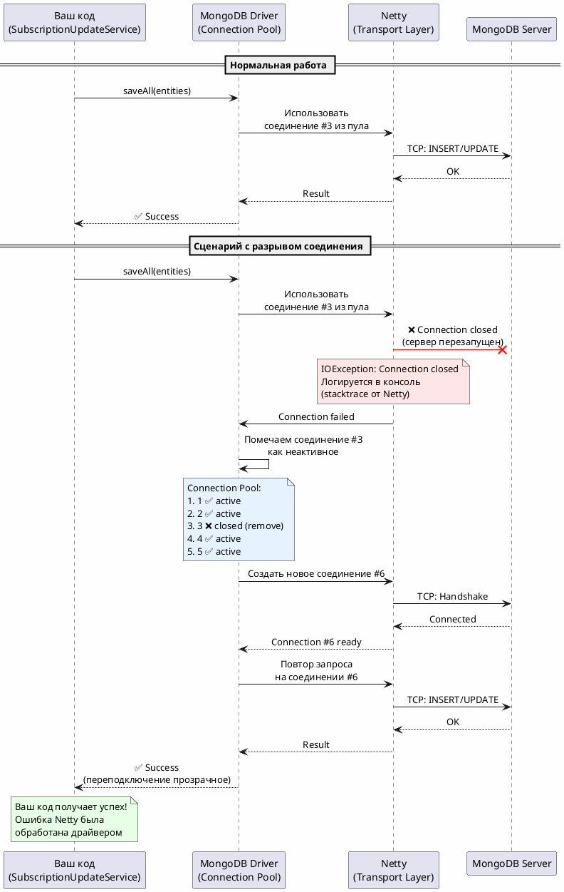

# Объяснение Kotlin Coroutines

## Оглавление

1. [withTimeout - Контроль времени выполнения](#withtimeout---контроль-времени-выполнения)
2. [suspend функции](#suspend-функции)
3. [CoroutineScope и launch](#coroutinescope-и-launch)
4. [async и await](#async-и-await)
5. [Flow vs List](#flow-vs-list)

---

## withTimeout - Контроль времени выполнения

`withTimeout(200.milliseconds) { ... }` — это **корутинная функция из Kotlin Coroutines**, которая работает так:

### Как работает `withTimeout`:

1. **Запускает блок кода** внутри фигурных скобок `{ ... }`.
2. **Устанавливает таймер** на 200 миллисекунд.
3. **Если блок завершается ДО истечения времени** — возвращает результат.
4. **Если блок НЕ завершается за 200мс** — бросает исключение `TimeoutCancellationException` и **отменяет корутину**.

### Пример из проекта:

```kotlin
val vendorDtos = withTimeout(200.milliseconds) {
    vendorService.fetchVendorDataForCus(cus, subscriptionMap.keys)
}
```

**Что происходит:**

- Вызывается `vendorService.fetchVendorDataForCus(...)` — это `suspend` функция (может выполняться долго).
- Если вендор ответил **быстрее 200мс** → результат записывается в `vendorDtos`.
- Если вендор **не успел за 200мс** → выбрасывается `TimeoutCancellationException`, выполнение прерывается, попадаем в блок `catch`.

### Зачем это нужно:

В нашем случае вендор может отвечать медленно (1 секунда в 20% случаев). Мы **не хотим ждать долго**, поэтому устанавливаем жесткий лимит: 200мс. Если вендор не успел — логируем ошибку и продолжаем работу без обновления.

### Альтернатива без `withTimeout`:

Если бы не было `withTimeout`, запрос к вендору мог бы висеть секунды/минуты, блокируя фоновую корутину.

**Итого:** `withTimeout` = "выполни блок, но не дольше N времени, иначе отмени и кинь ошибку".

---

## suspend функции

`suspend` — это ключевое слово в Kotlin, которое обозначает функцию, способную приостанавливать выполнение без блокировки потока.

### Основные правила:

- Функция помечается как `suspend`, если она вызывает другие `suspend` функции или выполняет асинхронные операции.
- `suspend` функции можно вызывать только из других `suspend` функций или из корутин.
- Spring WebFlux автоматически создает корутину для `suspend` методов контроллеров.

### Пример из проекта:

```kotlin
suspend fun updateSubscriptionsWithVendorData(cus: String): List<SubscriptionDto> {
    val subscriptions = subscriptionRepository.findByCus(cus).toList() // suspend вызов
    // ...
}
```

---

## CoroutineScope и launch

### CoroutineScope - Область жизни корутин

`CoroutineScope` — это контекст, в котором запускаются корутины. Он определяет:
- **Жизненный цикл** корутин (когда они должны быть отменены)
- **Диспетчер** (на каких потоках выполняются)
- **Обработку ошибок**

### Зачем создали Bean в конфигурации:

```kotlin
@Configuration
class CoroutineScopeConfiguration {
    @Bean
    fun payCoroutineScope(): CoroutineScope = CoroutineScope(Dispatchers.IO + SupervisorJob())
}
```

**Причины:**

1. **Spring управляет жизненным циклом** — scope создается при старте приложения и живет до его остановки.
2. **Переиспользование** — один и тот же scope используется для всех фоновых задач.
3. **Централизованная конфигурация** — все фоновые корутины используют единые настройки.
4. **Избегаем GlobalScope** — `GlobalScope` живет вечно и может привести к утечкам памяти.

### Компоненты scope:

#### Dispatchers.IO

```kotlin
Dispatchers.IO
```

- **Для чего:** Оптимизирован для IO-операций (сеть, БД, файлы).
- **Пул потоков:** До 64 потоков (или больше, если нужно).
- **Когда использовать:** Запросы к внешним API, работа с базой данных.

**Альтернативы:**
- `Dispatchers.Default` — для CPU-интенсивных задач (вычисления, парсинг)
- `Dispatchers.Main` — для UI (Android/Desktop)

#### SupervisorJob()

```kotlin
SupervisorJob()
```

**Для чего:** Контролирует поведение при ошибках в дочерних корутинах.

**Отличия Job vs SupervisorJob:**

| Тип | Поведение при ошибке в дочерней корутине |
|-----|------------------------------------------|
| `Job()` | **Отменяет ВСЕ** дочерние корутины и сам scope |
| `SupervisorJob()` | **Изолирует ошибки** — падение одной корутины не влияет на другие |

**Пример:**

Без `SupervisorJob`:
```kotlin
val scope = CoroutineScope(Dispatchers.IO + Job())
scope.launch { error("Ошибка!") } // Упала
scope.launch { delay(1000); println("Работаю") } // НЕ выполнится, т.к. scope отменен
```

С `SupervisorJob`:
```kotlin
val scope = CoroutineScope(Dispatchers.IO + SupervisorJob())
scope.launch { error("Ошибка!") } // Упала
scope.launch { delay(1000); println("Работаю") } // Выполнится нормально
```

**Почему в проекте используется SupervisorJob:**

В нашем случае фоновое обновление подписок для одного пользователя не должно влиять на обновления для других пользователей. Если запрос вендора для `cus=123` упал, это не должно останавливать обновления для `cus=456`.

### launch - Запуск фоновой корутины

```kotlin
payCoroutineScope.launch {
    // Фоновая работа
}
```

**Что делает:**
- Запускает новую корутину в указанном scope.
- **Не блокирует** вызывающий код — выполнение продолжается сразу.
- **Fire-and-forget** — результат не возвращается (в отличие от `async`).

**Пример из проекта:**

```kotlin
payCoroutineScope.launch {
    // Пакетный запрос к вендору
    val vendorDtos = withTimeout(200.milliseconds) {
        vendorService.fetchVendorDataForCus(cus, subscriptionMap.keys)
    }
    // Обновление БД
}
// Код продолжается СРАЗУ, не дожидаясь завершения launch
return subscriptions.map { mapper.toDto(it) }
```

---

## async и await

_(Раздел будет дополнен при необходимости)_

`async` — запускает корутину, которая **возвращает результат** через `await()`.

**Отличие от launch:**
- `launch` — ничего не возвращает (fire-and-forget)
- `async` — возвращает `Deferred<T>`, из которого можно получить результат через `await()`

**Когда использовать:**
- Для параллельного выполнения нескольких задач с ожиданием всех результатов.

---

## Flow vs List

### Flow<T>

- **Холодный поток** — элементы генерируются по требованию.
- **Асинхронный** — поддерживает backpressure, можно обрабатывать по одному.
- **Ленивый** — вычисления начинаются только при подписке.

**Пример:**
```kotlin
fun getSubscriptions(): Flow<SubscriptionDto> = flow {
    repeat(1000) {
        emit(createDto()) // Генерируется по одному
    }
}
```

### List<T>

- **Коллекция в памяти** — все элементы загружены сразу.
- **Синхронный** — весь список формируется до возврата.
- **Eager** — вычисления выполняются сразу.

**Пример:**
```kotlin
suspend fun getSubscriptions(): List<SubscriptionDto> {
    val subscriptions = repository.findByCus(cus).toList() // Загрузили всё
    return subscriptions.map { mapper.toDto(it) } // Преобразовали всё
}
```

### Что выбрать в проекте:

**Используем `List`**, потому что:
1. Все подписки пользователя нужны **сразу целиком** для формирования ответа.
2. Количество подписок обычно **небольшое** (десятки, не миллионы).
3. **Проще** для клиента — получил массив JSON и всё.

**`Flow` был бы полезен, если:**
- Миллионы записей (стриминг по частям).
- Клиент хочет получать данные по мере готовности (SSE, WebSocket).

---

## Обработка исключений (Exception Handling)

### Структура обработки в проекте:

```kotlin
try {
    val vendorDtos = withTimeout(200.milliseconds) {
        vendorService.fetchVendorDataForCus(cus, subscriptionMap.keys)
    }
    // Обновление БД
} catch (e: TimeoutCancellationException) {
    log.error("Timeout пакетного запроса к вендору для cus: {}", cus)
} catch (e: CancellationException) {
    throw e  // ❗ Важно: пробрасываем дальше
} catch (e: Exception) {
    log.error("Ошибка пакетного запроса к вендору для cus: {}", cus, e)
}
```

### Почему именно такая последовательность?

#### 1. TimeoutCancellationException — первым

```kotlin
catch (e: TimeoutCancellationException) {
    log.error("Timeout пакетного запроса к вендору для cus: {}", cus)
}
```

**Причина:**
- Это **специфичная** ошибка таймаута от `withTimeout`.
- Мы **логируем и поглощаем** её — обновление не критично, клиент уже получил данные из БД.
- Наследуется от `CancellationException`, поэтому должна быть **перед** общим catch для `CancellationException`.

#### 2. CancellationException — пробрасываем

```kotlin
catch (e: CancellationException) {
    throw e  // ❗ НЕ ПОГЛОЩАЕМ
}
```

**Почему пробрасываем:**

`CancellationException` — это **сигнал отмены корутины**. Его нельзя поглощать, иначе:
- Корутина не отменится корректно.
- Могут быть утечки ресурсов.
- Нарушится structured concurrency.

**Когда возникает:**
- Явный вызов `job.cancel()`.
- Отмена родительской корутины.
- Отмена всего scope (например, при остановке приложения).

**Правило:** Всегда пробрасывайте `CancellationException`, если не знаете точно, что делаете.

#### 3. Exception — общая сетка

```kotlin
catch (e: Exception) {
    log.error("Ошибка пакетного запроса к вендору для cus: {}", cus, e)
}
```

**Для чего:**
- Ловит **все остальные ошибки** (сеть, парсинг, БД).
- Логируем и **поглощаем** — фоновое обновление не должно ронять приложение.
- Клиент уже получил ответ, обновление — best effort.

### Порядок catch блоков (важно!):

Kotlin (как и Java) проверяет catch блоки **сверху вниз**, поэтому:

1. **Сначала** — самые **специфичные** исключения (`TimeoutCancellationException`).
2. **Потом** — более **общие** родительские классы (`CancellationException`).
3. **В конце** — **самый общий** catch (`Exception`).

**Неправильный порядок:**

```kotlin
catch (e: Exception) { ... }  // Поймает всё, включая CancellationException
catch (e: CancellationException) { ... }  // Никогда не выполнится
```

### Схема иерархии исключений:

```
Throwable
    └─ Exception
        └─ CancellationException (корутины)
            └─ TimeoutCancellationException (withTimeout)
```

### Почему не ловим в других местах:

В методе контроллера **нет try-catch**:

```kotlin
suspend fun updateSubscriptions(@RequestHeader("AUTH-USER-ID") cus: String): ResponseEntity<List<SubscriptionDto>> {
    val subscriptions = subscriptionUpdateService.updateSubscriptionsWithVendorData(cus)
    return ResponseEntity.ok(subscriptions)
}
```

**Причина:**
- Если ошибка в **основном потоке** (чтение из БД) — она должна **прилететь клиенту** как HTTP 500.
- Spring автоматически обработает исключение и вернет корректный HTTP-ответ.
- Фоновые ошибки (в `launch`) **не влияют** на ответ клиенту, т.к. они изолированы в своей корутине.

---

## Утилиты для безопасной обработки ошибок

### runCatchingCancellable и runCatchingCancellableSuspend

В проекте созданы две утилиты в `CoroutinesUtils.kt` для **функционального стиля** обработки ошибок:

#### runCatchingCancellable

```kotlin
inline fun <R> runCatchingCancellable(block: () -> R): Result<R> {
    return try {
        Result.success(block())
    } catch (e: Throwable) {
        if (e is CancellationException) throw e else Result.failure(e)
    }
}
```

**Для чего:**
- Аналог стандартного `runCatching` из Kotlin stdlib.
- **Отличие:** Корректно обрабатывает `CancellationException` — пробрасывает её, а не поглощает.
- **Для обычных (не suspend) блоков кода.**

**Пример использования:**

```kotlin
val result = runCatchingCancellable {
    expensiveCalculation()
}

result.onSuccess { value ->
    println("Успех: $value")
}.onFailure { error ->
    log.error("Ошибка вычисления", error)
}
```

**Преимущества:**
- Функциональный стиль (без try-catch).
- Возвращает `Result<R>` — можно цепочками обрабатывать через `onSuccess`/`onFailure`/`map`/`getOrElse`.
- Безопасно для корутин (не ломает cancellation).

#### runCatchingCancellableSuspend

```kotlin
suspend inline fun <R> runCatchingCancellableSuspend(crossinline block: suspend () -> R): Result<R> {
    return try {
        Result.success(block())
    } catch (e: Throwable) {
        if (e is CancellationException) throw e else Result.failure(e)
    }
}
```

**Для чего:**
- Версия для **suspend блоков** (асинхронных операций).
- Работает точно так же, но блок может содержать `suspend` функции.

**Пример использования:**

```kotlin
val result = runCatchingCancellableSuspend {
    vendorService.fetchVendorDataForCus(cus, publicIds)
}

result.onSuccess { vendorDtos ->
    // Обновляем БД
    updateDatabase(vendorDtos)
}.onFailure { error ->
    log.error("Ошибка запроса к вендору", error)
}
```

### Почему в проекте НЕ используются эти утилиты?

В текущей реализации `SubscriptionUpdateService` используется **императивный стиль** с `try-catch`, а не эти утилиты.

**Причины:**

#### 1. Разные типы ошибок требуют разных действий

```kotlin
try {
    val vendorDtos = withTimeout(200.milliseconds) { ... }
    // Обновление БД
} catch (e: TimeoutCancellationException) {
    log.error("Timeout") // Специфичная обработка
} catch (e: CancellationException) {
    throw e // Пробрасываем
} catch (e: Exception) {
    log.error("Ошибка") // Общая обработка
}
```

С `runCatchingCancellableSuspend` нужно было бы делать:

```kotlin
val result = runCatchingCancellableSuspend {
    withTimeout(200.milliseconds) { ... }
}

result.onFailure { error ->
    when (error) {
        is TimeoutCancellationException -> log.error("Timeout")
        else -> log.error("Ошибка", error)
    }
    // Но мы потеряли CancellationException, т.к. она была проброшена раньше
}
```

Видно, что **try-catch читается проще** для множественных типов ошибок.

#### 2. Императивный стиль понятнее для сложной логики

Текущий код:

```kotlin
try {
    val vendorDtos = withTimeout(...) { ... }
    val entitiesToUpdate = vendorDtos.mapNotNull { ... }
    if (entitiesToUpdate.isNotEmpty()) {
        subscriptionRepository.saveAll(entitiesToUpdate).collect()
    }
} catch (e: TimeoutCancellationException) { ... }
```

Это **линейный поток** — читается сверху вниз, все действия явные.

С `Result<T>`:

```kotlin
runCatchingCancellableSuspend {
    withTimeout(...) { ... }
}.onSuccess { vendorDtos ->
    val entitiesToUpdate = vendorDtos.mapNotNull { ... }
    if (entitiesToUpdate.isNotEmpty()) {
        runCatchingCancellableSuspend {
            subscriptionRepository.saveAll(entitiesToUpdate).collect()
        }.onFailure { ... } // Ещё один уровень вложенности
    }
}.onFailure { ... }
```

Вложенность растёт, читаемость падает.

#### 3. Утилиты полезны для других случаев

Эти функции **не бесполезны**! Они пригодятся в других местах:

**Хорошие сценарии для `runCatchingCancellable`:**

```kotlin
// Парсинг JSON (не suspend)
val user = runCatchingCancellable {
    jsonMapper.readValue<User>(jsonString)
}.getOrElse { User.default() }

// Вызов external API с обработкой
suspend fun fetchUserSafely(id: String): User? {
    return runCatchingCancellableSuspend {
        apiClient.getUser(id)
    }.onFailure { error ->
        log.error("Failed to fetch user $id", error)
    }.getOrNull()
}

// Цепочка преобразований
val result = runCatchingCancellableSuspend {
    fetchData()
}.map { data ->
    processData(data)
}.map { processed ->
    saveToDb(processed)
}.getOrElse { emptyList() }
```

### Когда использовать что?

| Сценарий | Рекомендация |
|----------|--------------|
| **Один тип ошибки**, простая обработка | `runCatchingCancellableSuspend` |
| **Множество типов ошибок**, разная логика | `try-catch` (как в проекте) |
| **Функциональные цепочки** (`map`, `flatMap`) | `runCatchingCancellableSuspend` |
| **Линейный императивный код** с несколькими шагами | `try-catch` |
| **Нужен `Result<T>` как возвращаемый тип** | `runCatchingCancellableSuspend` |

### Проблема стандартного runCatching

Стандартный `runCatching` из Kotlin stdlib **ОПАСЕН** для корутин:

```kotlin
// ❌ ПЛОХО — поглощает CancellationException
val result = runCatching {
    delay(1000)
    fetchData()
}
// Корутина не отменится при cancel()
```

**Почему проблема:**
- `runCatching` ловит **ВСЕ** исключения, включая `CancellationException`.
- `CancellationException` оборачивается в `Result.failure`.
- Корутина не отменяется корректно → утечки ресурсов, висячие задачи.

**Решение — наши утилиты:**

```kotlin
// ✅ ХОРОШО — CancellationException пробрасывается
val result = runCatchingCancellableSuspend {
    delay(1000)
    fetchData()
}
// Корутина корректно отменится при cancel()
```

### Итого

**Утилиты `runCatchingCancellable[Suspend]`:**
- ✅ Созданы для безопасной работы с корутинами.
- ✅ Функциональный стиль обработки ошибок.
- ✅ **Используются в `SubscriptionUpdateService`** для фонового обновления подписок.
- ✅ Полезны для других частей проекта (API-клиенты, парсинг, функциональные цепочки).

---

## Разбор кода фонового обновления (функциональный стиль)

### Полный код фонового обновления

```kotlin
payCoroutineScope.launch {
    // Пакетный запрос к вендору по cus с таймаутом 200мс
    val vendorResult = runCatchingCancellableSuspend {
        withTimeout(200.milliseconds) {
            vendorService.fetchVendorDataForCus(cus, subscriptionMap.keys)
        }
    }
    
    vendorResult.onSuccess { vendorDtos ->
        // Сопоставляем по publicId и обновляем
        val entitiesToUpdate = vendorDtos.mapNotNull { vendorDto ->
            subscriptionMap[vendorDto.publicId]?.apply {
                mapper.updateEntityWithVendorData(this, vendorDto)
            }
        }
        if (entitiesToUpdate.isNotEmpty()) {
            runCatchingCancellableSuspend {
                subscriptionRepository.saveAll(entitiesToUpdate).collect()
            }.onSuccess {
                log.info("Пакетно обновлено {} подписок в БД", entitiesToUpdate.size)
            }.onFailure { error ->
                log.error("Ошибка сохранения подписок в БД для cus: {}", cus, error)
            }
        }
    }.onFailure { error ->
        when (error) {
            is TimeoutCancellationException -> log.error("Timeout пакетного запроса к вендору для cus: {}", cus)
            else -> log.error("Ошибка пакетного запроса к вендору для cus: {}", cus, error)
        }
    }
}
```

### Пошаговый разбор

#### Шаг 1: Запуск фоновой корутины

```kotlin
payCoroutineScope.launch {
    // ...
}
```

**Что происходит:**
- Запускается **независимая** корутина в управляемом Spring scope.
- Выполнение **не блокирует** основной поток — клиент сразу получит ответ.
- Корутина работает **fire-and-forget** (запустили и забыли).

#### Шаг 2: Безопасный запрос к вендору с таймаутом

```kotlin
val vendorResult = runCatchingCancellableSuspend {
    withTimeout(200.milliseconds) {
        vendorService.fetchVendorDataForCus(cus, subscriptionMap.keys)
    }
}
```

**Что происходит:**

1. **`withTimeout(200.milliseconds)`** — устанавливает жесткий лимит времени:
   - Если вендор ответил **за 200мс** → продолжаем.
   - Если вендор **не успел за 200мс** → бросается `TimeoutCancellationException`.

2. **`runCatchingCancellableSuspend`** — оборачивает результат:
   - **Успех:** `Result.success(vendorDtos)` — список `SubscriptionVendorDto`.
   - **Ошибка:** `Result.failure(exception)` — любое исключение (кроме `CancellationException`).
   - **Отмена:** `CancellationException` **пробрасывается** дальше (не ловится).

3. **`vendorResult`** — это объект типа `Result<List<SubscriptionVendorDto>>`.

#### Шаг 3: Обработка успешного ответа вендора

```kotlin
vendorResult.onSuccess { vendorDtos ->
    // Сопоставляем по publicId и обновляем
    val entitiesToUpdate = vendorDtos.mapNotNull { vendorDto ->
        subscriptionMap[vendorDto.publicId]?.apply {
            mapper.updateEntityWithVendorData(this, vendorDto)
        }
    }
    // ...
}
```

**Что происходит:**

1. **`.onSuccess { vendorDtos -> ... }`** — выполнится **ТОЛЬКО если** вендор ответил успешно.
   - `vendorDtos` — распакованный список `List<SubscriptionVendorDto>`.

2. **Сопоставление по `publicId`:**
   ```kotlin
   vendorDtos.mapNotNull { vendorDto ->
       subscriptionMap[vendorDto.publicId]?.apply {
           mapper.updateEntityWithVendorData(this, vendorDto)
       }
   }
   ```
   - Для каждого `vendorDto` ищем соответствующую `entity` в `subscriptionMap` по `publicId`.
   - Если `entity` найдена — обновляем её данными от вендора через маппер.
   - `mapNotNull` — отфильтровывает `null` (если `publicId` не найден в БД).
   - **Результат:** список `List<SubscriptionEntity>` с обновленными данными.

#### Шаг 4: Сохранение в БД с обработкой ошибок

```kotlin
if (entitiesToUpdate.isNotEmpty()) {
    runCatchingCancellableSuspend {
        subscriptionRepository.saveAll(entitiesToUpdate).collect()
    }.onSuccess {
        log.info("Пакетно обновлено {} подписок в БД", entitiesToUpdate.size)
    }.onFailure { error ->
        log.error("Ошибка сохранения подписок в БД для cus: {}", cus, error)
    }
}
```

**Что происходит:**

1. **Проверка на пустоту:**
   - Если нечего сохранять (все `publicId` не совпали) — пропускаем сохранение.

2. **Безопасное сохранение:**
   ```kotlin
   runCatchingCancellableSuspend {
       subscriptionRepository.saveAll(entitiesToUpdate).collect()
   }
   ```
   - `saveAll()` — пакетное сохранение (один запрос к БД, а не по документу).
   - `.collect()` — ждем завершения сохранения (т.к. `saveAll` возвращает `Flow`).
   - `runCatchingCancellableSuspend` — оборачивает результат в `Result`.

3. **Обработка результата:**
   - `.onSuccess { ... }` — если сохранение прошло успешно → логируем количество обновленных записей.
   - `.onFailure { error -> ... }` — если БД вернула ошибку (сеть, constraint, timeout) → логируем ошибку, но **не роняем** приложение.

**Важно:** Ошибка сохранения в БД **не влияет** на ответ клиенту — он уже получил данные на **шаге возврата** (до `launch`).

#### Шаг 5: Обработка ошибки вендора

```kotlin
.onFailure { error ->
    when (error) {
        is TimeoutCancellationException -> log.error("Timeout пакетного запроса к вендору для cus: {}", cus)
        else -> log.error("Ошибка пакетного запроса к вендору для cus: {}", cus, error)
    }
}
```

**Что происходит:**

1. **`.onFailure { error -> ... }`** — выполнится **ТОЛЬКО если** запрос к вендору упал.
   - `error` — распакованное исключение из `Result.failure(exception)`.

2. **Различная обработка по типу:**
   ```kotlin
   when (error) {
       is TimeoutCancellationException -> ...  // Вендор не успел за 200мс
       else -> ...  // Другие ошибки (сеть, парсинг, HTTP 500)
   }
   ```

3. **Только логирование:**
   - Мы **не пробрасываем** ошибку дальше.
   - Мы **не роняем** корутину.
   - Просто записываем в лог и продолжаем работу приложения.

**Почему так:**
- Клиент **уже получил ответ** с данными из БД.
- Обновление от вендора — **опциональная** оптимизация (best effort).
- Падение вендора **не должно** ломать основной функционал.

### Преимущества функционального стиля

#### 1. Явная обработка обоих путей

```kotlin
vendorResult
    .onSuccess { /* Путь успеха */ }
    .onFailure { /* Путь ошибки */ }
```

Сразу видно:
- Что происходит при **успехе**.
- Что происходит при **ошибке**.

#### 2. Цепочка обработки

```kotlin
runCatchingCancellableSuspend { saveAll() }
    .onSuccess { log.info() }
    .onFailure { log.error() }
```

Можно строить цепочки преобразований:
- `.map { transform(it) }`
- `.getOrElse { defaultValue }`
- `.fold(onSuccess = {}, onFailure = {})`

#### 3. Отсутствие вложенных try-catch

Императивный стиль:
```kotlin
try {
    val vendorDtos = fetchVendor()
    try {
        saveToDb(vendorDtos)
        log.info("Успех")
    } catch (e: Exception) {
        log.error("Ошибка БД")
    }
} catch (e: Exception) {
    log.error("Ошибка вендора")
}
```

Функциональный стиль:
```kotlin
runCatchingCancellableSuspend { fetchVendor() }
    .onSuccess { vendorDtos ->
        runCatchingCancellableSuspend { saveToDb(vendorDtos) }
            .onSuccess { log.info("Успех") }
            .onFailure { log.error("Ошибка БД") }
    }
    .onFailure { log.error("Ошибка вендора") }
```

Структура **плоская**, вложенность **логическая** (не синтаксическая).

#### 4. Автоматическая обработка CancellationException

Не нужно явно писать:
```kotlin
catch (e: CancellationException) {
    throw e  // Не забыть!
}
```

Утилита **автоматически** пробрасывает её.

### Поток выполнения (timeline)

```
t=0ms   → Клиент отправил PUT /api/subscriptions
t=5ms   → Загрузили подписки из БД (subscriptionRepository.findByCus)
t=6ms   → Сформировали ответ клиенту (List<SubscriptionDto>)
t=7ms   → Запустили фоновую корутину (payCoroutineScope.launch)
t=8ms   → КЛИЕНТ ПОЛУЧИЛ ОТВЕТ 200 OK с данными из БД ✅
          ────────────────────────────────────────────────
          Фоновая корутина продолжает работу:
t=10ms  → Начали запрос к вендору (vendorService.fetchVendorDataForCus)
t=150ms → Вендор ответил (успели за 200мс)
t=155ms → Сопоставили данные по publicId
t=160ms → Начали saveAll в БД
t=180ms → Сохранение завершено
t=181ms → Залогировали "Пакетно обновлено 5 подписок в БД"
          Корутина завершилась ✅
```

**Если таймаут:**

```
t=0ms   → Клиент отправил PUT
t=8ms   → КЛИЕНТ ПОЛУЧИЛ ОТВЕТ 200 OK ✅
t=10ms  → Начали запрос к вендору
t=210ms → Timeout! (прошло 200мс)
t=211ms → onFailure { TimeoutCancellationException }
t=212ms → Залогировали "Timeout пакетного запроса к вендору"
          Корутина завершилась, БД НЕ обновлялась ✅
```

### Ключевые моменты

1. **Клиент не ждет обновления** — получает данные моментально.
2. **Таймаут изолирован** — не влияет на ответ клиенту.
3. **Ошибки БД изолированы** — не ломают основной поток.
4. **CancellationException корректно обрабатывается** — корутина отменяется при shutdown приложения.
5. **Логи прозрачны** — видно, на каком этапе что упало.

### Итоговая схема обработки

```
runCatchingCancellableSuspend { fetchVendor() }
│
├─ onSuccess (vendorDtos) ───────────────┐
│  │                                      │
│  ├─ Сопоставление по publicId           │
│  │                                      │
│  └─ runCatchingCancellableSuspend { saveAll() }
│     │                                   │
│     ├─ onSuccess → log.info("Успех")    │
│     └─ onFailure → log.error("БД")      │
│                                         │
└─ onFailure (error) ────────────────────┘
   │
   ├─ is TimeoutCancellationException → log.error("Timeout")
   └─ else → log.error("Ошибка вендора")
```

Каждый **уровень вложенности** = **отдельная операция** с её собственной обработкой ошибок.

---

## Обработка сетевых ошибок MongoDB (Netty Connection Pool)

### Почему некоторые ошибки не попадают в catch-блоки

Иногда в консоли можно увидеть stacktrace от MongoDB/Netty:

```
Caused by: java.io.IOException: The connection to the server was closed
	at com.mongodb.internal.connection.netty.NettyStream$OpenChannelFutureListener...
	at io.netty.channel.AbstractChannel$AbstractUnsafe.close...
```

Но при этом **ваш код не ловит эту ошибку** в catch-блоках, и операция **завершается успешно**.

### Причина: Connection Pool с автоматическим переподключением

MongoDB драйвер использует **пул соединений** с механизмом **автоматического восстановления**.

#### Архитектура взаимодействия (PlantUML)



### Пошаговое объяснение

#### 1. Начальное состояние

MongoDB драйвер держит **пул открытых соединений** (по умолчанию 5-10):

```
Connection Pool:
├─ Connection #1 ✅ active (к MongoDB primary)
├─ Connection #2 ✅ active
├─ Connection #3 ✅ active
├─ Connection #4 ✅ active
└─ Connection #5 ✅ active
```

#### 2. Ваш код вызывает saveAll()

```kotlin
runCatchingCancellableSuspend {
    subscriptionRepository.saveAll(entitiesToUpdate).collect()
}.onSuccess { ... }
  .onFailure { ... } // ❓ Почему сюда не попадаем?
```

Драйвер выбирает соединение #3 из пула.

#### 3. Соединение разрывается (внешняя причина)

**Возможные причины:**
- MongoDB сервер перезапущен
- Сетевой сбой (firewall, роутер)
- Истекло время keep-alive
- Сервер закрыл idle соединение

**Что происходит:**

```
Netty Thread (фоновый поток):
└─ Обнаруживает: TCP connection closed
   └─ Логирует: IOException в консоль (stacktrace)
   └─ Уведомляет драйвер: "Connection #3 dead"
```

**Важно:** Это происходит в **фоновом потоке Netty**, не в вашей корутине!

#### 4. Драйвер автоматически восстанавливается

```
MongoDB Driver:
1. Помечает Connection #3 как неактивное
2. Удаляет из пула
3. Создает новое Connection #6
4. Добавляет в пул
5. Повторяет операцию на новом соединении
6. Возвращает успех вашему коду ✅
```

#### 5. Ваш код получает успешный результат

```kotlin
runCatchingCancellableSuspend {
    subscriptionRepository.saveAll(...).collect()
}.onSuccess {
    log.info("Успешно!") // ← Попадаем сюда
}
```

### Почему ошибка не ловится в вашем коде

| Аспект | Объяснение |
|--------|-----------|
| **Где произошла ошибка** | Внутри Netty (транспортный уровень) |
| **Когда произошла** | Асинхронно, в фоновом потоке Netty |
| **Кто обработал** | MongoDB Driver автоматически |
| **Что получил ваш код** | Успешный результат после переподключения |
| **Почему stacktrace в консоли** | Netty логирует внутренние события |

### Когда ВЫ увидите ошибку

Ваш catch-блок сработает только если:

1. **Все попытки переподключения провалились**
   ```
   MongoDB недоступен > 30 секунд
   → MongoTimeoutException → ваш catch
   ```

2. **Ошибка бизнес-логики**
   ```
   Duplicate key constraint
   → DuplicateKeyException → ваш catch
   ```

3. **Ошибка валидации**
   ```
   Invalid document structure
   → ValidationException → ваш catch
   ```

### Настройка логирования

Чтобы не видеть эти stacktrace в консоли (они не критичны):

```yaml
logging:
  level:
    org.mongodb.driver: WARN    # Скрывает DEBUG от драйвера
    io.netty: WARN              # Скрывает stacktrace от Netty
    com.mongodb: WARN           # Скрывает внутренние логи MongoDB
```

**Эффект:**
- ✅ Реальные ошибки (операция провалилась) все равно попадут в ваш catch
- ✅ Спам от внутренних переподключений исчезнет из консоли
- ✅ Production-логи станут чище

### Как проверить реальную ошибку БД

#### Способ 1: Остановить MongoDB

```bash
docker stop mongodb
```

Через 30 секунд ваш catch поймает `MongoTimeoutException`.

#### Способ 2: Имитировать duplicate key

В `VendorService` добавлена логика:

```kotlin
// 5% вероятность: вендор вернет дубликат publicId
if (Random.nextInt(100) < 5) {
    val duplicate = result.first().copy()
    result.add(duplicate)
}
```

Но код **защищен** через `distinctBy { it.publicId }`, поэтому ошибки не будет.

#### Способ 3: Создать невалидный документ

Временно убрать валидацию и попытаться сохранить `null` в обязательное поле.

### Итого

**Connection Pool работает как "самовосстанавливающаяся" прослойка:**

```
Ваш код
   ↓
  [try-catch]  ← Ловит только "неисправимые" ошибки
   ↓
MongoDB Driver + Connection Pool
   ↓
  [auto-retry] ← Обрабатывает сетевые сбои
   ↓
Netty (TCP)
   ↓
MongoDB Server
```

Это **нормальное поведение** production-систем — клиентский код не должен заботиться о временных сетевых сбоях.

---

## Labeled returns в Kotlin (return@label)

### Что такое labeled return

В Kotlin, когда вы используете `return` внутри лямбды, по умолчанию он **выходит из всей функции**, а не только из лямбды. Чтобы вернуться только **из лямбды**, используется **labeled return** с символом `@`.

### Проблема без меток

```kotlin
fun processItems(): List<String> {
    val items = listOf(1, 2, 3, 4, 5)
    
    return items.map { item ->
        if (item > 3) {
            return emptyList()  // ❌ Выходит из ВСЕЙ функции processItems
        }
        "Item $item"
    }
}

// Результат: emptyList(), как только встретили item > 3
```

**Проблема:** `return` выходит из **функции `processItems`**, а не из лямбды `map`.

### Решение: labeled return

```kotlin
fun processItems(): List<String> {
    val items = listOf(1, 2, 3, 4, 5)
    
    return items.map { item ->
        if (item > 3) {
            return@map ""  // ✅ Выходит только из лямбды map
        }
        "Item $item"
    }
}

// Результат: ["Item 1", "Item 2", "Item 3", "", ""]
```

**Решение:** `return@map` возвращает значение **только из лямбды `map`**.

### Синтаксис

```kotlin
return@label value
```

- `@label` — метка, указывающая на контекст (обычно имя функции высшего порядка)
- `value` — возвращаемое значение из лямбды

### Пример из проекта

```kotlin
val entitiesToUpdate = vendorDtos
    .mapNotNull { vendorDto ->
        val entity = subscriptionMap[vendorDto.publicId]
        if (entity == null) {
            return@mapNotNull null  // ← Возвращаем null из лямбды mapNotNull
        }
        entity.apply {
            mapper.updateEntityWithVendorData(this, vendorDto)
        }
    }
```

**Что происходит:**

1. `mapNotNull` проходит по каждому `vendorDto`
2. Если `entity == null`, `return@mapNotNull null` возвращает `null` **из текущей итерации лямбды**
3. `mapNotNull` **автоматически фильтрует** этот `null`
4. Функция `processItems` продолжает выполнение для следующих элементов
5. В `entitiesToUpdate` попадают только **ненулевые** значения

### Типы меток

#### 1. Неявная метка (имя функции)

```kotlin
list.forEach { item ->
    if (item < 0) return@forEach  // Метка = имя функции
}
```

#### 2. Явная метка (custom)

```kotlin
list.forEach outerLoop@ { item ->
    if (item < 0) return@outerLoop  // Метка = custom имя
}
```

#### 3. Анонимная функция (без метки)

```kotlin
list.forEach(fun(item) {
    if (item < 0) return  // Выходит только из анонимной функции
})
```

### Сравнение вариантов

| Вариант | Код | Что делает |
|---------|-----|-----------|
| Обычный return | `return value` | Выходит из **всей функции** |
| Labeled return | `return@map value` | Выходит из **лямбды map** |
| Анонимная функция | `map(fun(x) { return value })` | Выходит из **анонимной функции** |

### Реальный пример с вложенными лямбдами

```kotlin
fun complexProcessing(): List<String> {
    val result = mutableListOf<String>()
    
    listOf(1, 2, 3).forEach outer@ { i ->
        listOf("a", "b", "c").forEach inner@ { j ->
            if (j == "b") {
                return@inner  // Пропускаем только "b", продолжаем outer
            }
            if (i == 2) {
                return@outer  // Пропускаем всю итерацию i=2
            }
            result.add("$i$j")
        }
    }
    
    return result
}

// Результат: ["1a", "1c", "3a", "3c"]
// i=2 полностью пропущено (return@outer)
// j="b" пропущено в каждой итерации (return@inner)
```

### Почему это важно в проекте

В нашем коде:

```kotlin
.mapNotNull { vendorDto ->
    val entity = subscriptionMap[vendorDto.publicId]
    if (entity == null) {
        log.warn("...")
        return@mapNotNull null  // Пропускаем эту итерацию
    }
    // Продолжаем обработку для следующих vendorDto
    entity.apply { ... }
}
```

**Без `@mapNotNull`:**
```kotlin
return null  // ❌ Вылет из всей функции updateSubscriptionsWithVendorData
             // Клиент получит пустой ответ!
```

**С `@mapNotNull`:**
```kotlin
return@mapNotNull null  // ✅ Пропускаем только текущий vendorDto
                        // Обработка продолжается для остальных
```

### Break vs Return в циклах

**Обычный цикл:**
```kotlin
for (item in items) {
    if (item > 5) break  // Выходит из цикла
}
```

**forEach с labeled return:**
```kotlin
items.forEach { item ->
    if (item > 5) return@forEach  // Эквивалент continue (пропускает итерацию)
}
```

**Важно:** В `forEach` нет прямого `break`. Для выхода из всего `forEach` нужно использовать обычный цикл или `run` с labeled return.

### Итого

**Labeled returns (`return@label`) позволяют:**
- ✅ Возвращать значения из лямбд, не выходя из всей функции
- ✅ Эмулировать `continue` в функциях высшего порядка (`forEach`, `map`, и т.д.)
- ✅ Делать код более явным и понятным
- ✅ Избегать неожиданного выхода из функций

**Правило:** Используйте `return@functionName` внутри лямбд, когда хотите вернуться **только из лямбды**, а не из всей функции.

