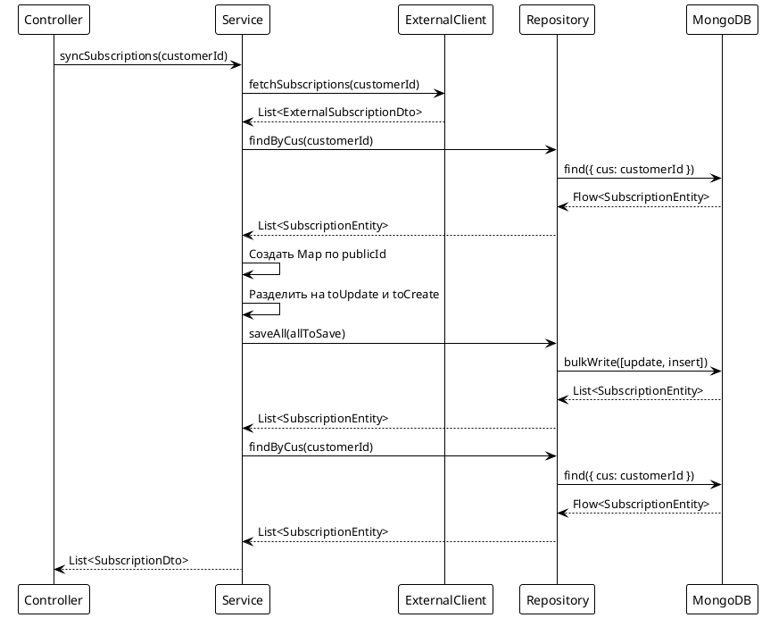

# Подход 1: Batch операции (saveAll)

## Содержание

- [Описание](#описание)
- [Архитектура](#архитектура)
- [Реализация](#реализация)
- [Запросы к БД](#запросы-к-бд)
- [Особенности Kotlin](#особенности-kotlin)
- [Преимущества и недостатки](#преимущества-и-недостатки)

## Описание

Подход использует batch операции через `saveAll()` для эффективной синхронизации подписок. Все существующие подписки загружаются в память, создается Map для быстрого поиска по `publicId`, затем все изменения сохраняются одним batch запросом.

## Архитектура



## Реализация

### Контроллер

```kotlin
@RestController
@RequestMapping("/api/subscriptions/sync")
class SubscriptionSyncController1(
    private val syncService: SubscriptionSyncService1
) {
    @PostMapping("/approach1")
    suspend fun syncSubscriptionsApproach1(
        @RequestHeader("AUTH-USER-ID") authUserId: String
    ): ResponseEntity<List<SubscriptionDto>> {
        val subscriptions = syncService.syncSubscriptions(authUserId)
        return ResponseEntity.ok(subscriptions)
    }
}
```

### Сервис

```kotlin
@Service
class SubscriptionSyncService1(
    private val repository: SubscriptionRepository,
    private val externalClient: ExternalSubscriptionClient,
    private val mapper: ExternalSubscriptionMapper
) {
    suspend fun syncSubscriptions(customerId: String): List<SubscriptionDto> {
        // Шаг 1: Получаем данные от внешнего сервиса
        val externalResponse = externalClient.fetchSubscriptions(customerId)
        val externalSubscriptions = externalResponse.subscriptions

        // Шаг 2: Загружаем существующие подписки из MongoDB
        val existingSubscriptions = repository.findByCus(customerId).toList()

        // Шаг 3: Создаем Map для быстрого поиска по publicId
        val existingMap = existingSubscriptions.associateBy { it.publicId }

        // Шаг 4: Разделяем подписки на обновляемые и новые
        val toUpdate = mutableListOf<SubscriptionEntity>()
        val toCreate = mutableListOf<SubscriptionEntity>()

        externalSubscriptions.forEach { externalDto ->
            val publicId = UUID.fromString(externalDto.subscriptionId)
            val existing = existingMap[publicId]

            if (existing != null) {
                mapper.updateEntity(existing, externalDto)
                toUpdate.add(existing)
            } else {
                val newEntity = mapper.toEntity(externalDto, customerId)
                toCreate.add(newEntity)
            }
        }

        // Шаг 5: Batch сохранение через saveAll
        val allToSave = toUpdate + toCreate
        if (allToSave.isNotEmpty()) {
            repository.saveAll(allToSave).toList()
        }

        // Шаг 6: Загружаем обновленные данные для возврата
        val result = repository.findByCus(customerId).toList()
        return result.map { entity -> /* преобразование в DTO */ }
    }
}
```

### Repository

```kotlin
@Repository
interface SubscriptionRepository : CoroutineCrudRepository<SubscriptionEntity, ObjectId> {
    fun findByCus(cus: String): Flow<SubscriptionEntity>
}
```

## Запросы к БД

### Метод 1: findByCus

**Derived Method:**
```kotlin
fun findByCus(cus: String): Flow<SubscriptionEntity>
```

**Что происходит:**
- Spring Data MongoDB автоматически генерирует запрос на основе имени метода
- `findBy` - начало запроса
- `Cus` - поле для поиска (соответствует полю `cus` в `SubscriptionEntity`)

**MongoDB запрос:**
```json
{ "cus": "customer123" }
```

**Особенности индексов:**
- Поле `cus` имеет индекс `@Indexed`, что ускоряет поиск
- Запрос использует индекс для быстрого поиска всех подписок клиента

### Метод 2: saveAll

**Метод из CoroutineCrudRepository:**
```kotlin
fun saveAll(entities: Iterable<SubscriptionEntity>): Flow<SubscriptionEntity>
```

**Что происходит:**
- Spring Data MongoDB определяет для каждой сущности: обновить или создать
- Если `entity.id == null` - выполняется INSERT
- Если `entity.id != null` - выполняется UPDATE по `_id`
- Все операции выполняются через `bulkWrite` для оптимизации

**MongoDB запрос (bulkWrite):**
```json
{
  "operations": [
    { "updateOne": { "filter": { "_id": ObjectId("...") }, "update": { "$set": {...} } } },
    { "insertOne": { "document": {...} } }
  ]
}
```

## Особенности Kotlin

### 1. Suspend функции

**Зачем нужны:**
- Позволяют выполнять неблокирующие операции
- Интегрируются с корутинами для асинхронной обработки
- Spring автоматически обрабатывает suspend функции в контроллерах

**Как работают:**
```kotlin
suspend fun syncSubscriptions(customerId: String): List<SubscriptionDto> {
    // Код выполняется в корутине
    // При вызове await операции (например, toList()) корутина приостанавливается
    // и освобождает поток для других задач
}
```

### 2. Kotlin Flow

**Использование:**
- `findByCus()` возвращает `Flow<SubscriptionEntity>` для реактивной обработки
- `toList()` собирает все элементы Flow в список
- Flow позволяет обрабатывать данные по мере их поступления из БД

**Пример:**
```kotlin
val existingSubscriptions = repository.findByCus(customerId).toList()
// Flow обрабатывается и собирается в List
```

### 3. Scope functions: associateBy

**associateBy:**
```kotlin
val existingMap = existingSubscriptions.associateBy { it.publicId }
```

**Что делает:**
- Создает Map, где ключ - результат lambda (`it.publicId`), значение - сам элемент
- Оптимизирует поиск существующих подписок с O(n) до O(1)
- Эффективное использование памяти для быстрого поиска

## Преимущества и недостатки

### Преимущества:

1. **Простота реализации** - понятный и читаемый код
2. **Batch операции** - все изменения сохраняются одним запросом через `saveAll`
3. **Эффективный поиск** - Map для O(1) поиска по `publicId`
4. **Минимум запросов к БД** - только 3 запроса: загрузка существующих, сохранение, загрузка результата

### Недостатки:

1. **Загрузка всех подписок в память** - при большом количестве подписок может быть неэффективно
2. **Дополнительный запрос** - загружаем все подписки дважды (для сравнения и для возврата)

### Когда использовать:

- Когда количество подписок клиента невелико (< 1000)
- Когда нужна простая и понятная реализация
- Когда важна надежность и предсказуемость


