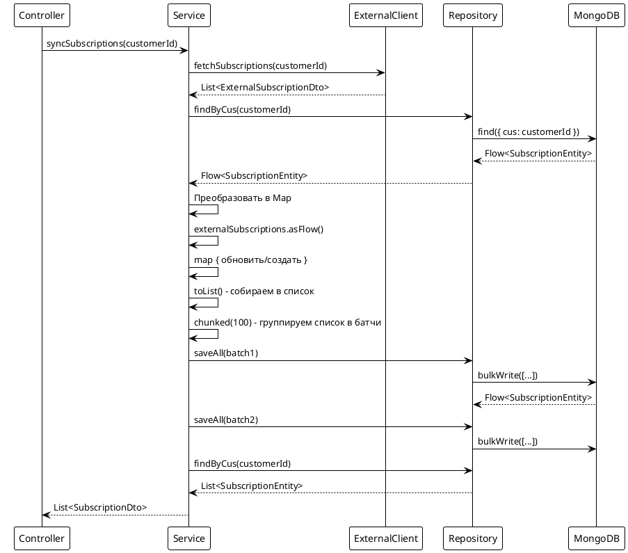

# Подход 2: Flow с batch обработкой

## Содержание

- [Описание](#описание)
- [Архитектура](#архитектура)
- [Реализация](#реализация)
- [Запросы к БД](#запросы-к-бд)
- [Особенности Kotlin](#особенности-kotlin)
- [Преимущества и недостатки](#преимущества-и-недостатки)

## Описание

Подход использует Kotlin Flow для реактивной обработки данных. Сначала все подписки обрабатываются через Flow и собираются в список, затем список разбивается на батчи через `chunked()` (метод для коллекций) и сохраняется батчами через `saveAll()` для оптимизации запросов к БД.

**Важно:** `chunked()` - это метод для коллекций (List, Sequence), а не для Flow. Поэтому сначала собираем Flow в список через `.toList()`, затем используем `.chunked()` на списке.

## Архитектура



## Реализация

### Контроллер

```kotlin
@RestController
@RequestMapping("/api/subscriptions/sync")
class SubscriptionSyncController2(
    private val syncService: SubscriptionSyncService2
) {
    @PostMapping("/approach2")
    suspend fun syncSubscriptionsApproach2(
        @RequestHeader("AUTH-USER-ID") authUserId: String
    ): ResponseEntity<List<SubscriptionDto>> {
        val subscriptions = syncService.syncSubscriptions(authUserId)
        return ResponseEntity.ok(subscriptions)
    }
}
```

### Сервис

```kotlin
@Service
class SubscriptionSyncService2(
    private val repository: SubscriptionRepository,
    private val externalClient: ExternalSubscriptionClient,
    private val mapper: ExternalSubscriptionMapper
) {
    private val batchSize = 100

    suspend fun syncSubscriptions(customerId: String): List<SubscriptionDto> {
        // Шаг 1: Получаем данные от внешнего сервиса
        val externalResponse = externalClient.fetchSubscriptions(customerId)
        val externalSubscriptions = externalResponse.subscriptions

        // Шаг 2: Загружаем существующие подписки через Flow
        val existingMap = repository.findByCus(customerId)
            .map { it.publicId to it }
            .toList()
            .toMap()

        // Шаг 3: Обрабатываем подписки через Flow
        // Сначала обрабатываем все подписки и собираем в список
        val allToSave = externalSubscriptions
            .asFlow() // Преобразуем List в Flow
            .map { externalDto ->
                val publicId = UUID.fromString(externalDto.subscriptionId)
                val existing = existingMap[publicId]

                if (existing != null) {
                    mapper.updateEntity(existing, externalDto)
                    existing
                } else {
                    mapper.toEntity(externalDto, customerId)
                }
            }
            .toList() // Собираем все обработанные подписки в список

        // Шаг 4: Сохраняем батчами через chunked() (метод для List)
        allToSave.chunked(batchSize).forEach { batch ->
            // Сохраняем каждый батч через saveAll
            repository.saveAll(batch).collect()
        }

        // Шаг 5: Загружаем обновленные данные для возврата
        val result = repository.findByCus(customerId).toList()
        return result.map { entity -> /* преобразование в DTO */ }
    }
}
```

### Repository

```kotlin
@Repository
interface SubscriptionRepository : CoroutineCrudRepository<SubscriptionEntity, ObjectId> {
    fun findByCus(cus: String): Flow<SubscriptionEntity>
}
```

## Запросы к БД

### Метод 1: findByCus

**Derived Method:**
```kotlin
fun findByCus(cus: String): Flow<SubscriptionEntity>
```

**MongoDB запрос:**
```json
{ "cus": "customer123" }
```

### Метод 2: saveAll (batch)

**Метод из CoroutineCrudRepository:**
```kotlin
fun saveAll(entities: Iterable<SubscriptionEntity>): Flow<SubscriptionEntity>
```

**Что происходит:**
- Выполняется несколько раз (по количеству батчей)
- Каждый батч обрабатывается через `bulkWrite`
- Оптимизация: вместо N запросов выполняется N/batchSize запросов
- Используется `chunked()` на списке для группировки в батчи

**MongoDB запрос (для батча из 100 элементов):**
```json
{
  "operations": [
    { "updateOne": {...} },
    { "insertOne": {...} },
    // ... до 100 операций
  ]
}
```

**Важно:** `chunked()` - это метод для коллекций (List, Sequence), а не для Flow. Поэтому сначала собираем Flow в список через `.toList()`, затем используем `.chunked()` на списке.

## Особенности Kotlin

### 1. Kotlin Flow операторы

**asFlow():**
```kotlin
externalSubscriptions.asFlow()
```
- Преобразует `List` в `Flow` для реактивной обработки
- Позволяет использовать Flow операторы (`map`, `toList`)

**map:**
```kotlin
.map { externalDto -> /* преобразование */ }
```
- Применяет функцию к каждому элементу Flow
- Создает новый Flow с преобразованными элементами

**toList:**
```kotlin
.toList()
```
- Собирает все элементы Flow в список
- Позволяет использовать методы коллекций (например, `chunked()`)
- Преобразует `Flow<T>` в `List<T>`

**chunked (для List):**
```kotlin
allToSave.chunked(batchSize)
```
- Группирует элементы списка в батчи указанного размера
- Возвращает `List<List<T>>` - список батчей
- Стандартный метод Kotlin для коллекций
- Критически важно для оптимизации batch операций

**forEach (для List):**
```kotlin
allToSave.chunked(batchSize).forEach { batch -> /* обработка батча */ }
```
- Обрабатывает каждый элемент списка (в данном случае каждый батч)
- Стандартный метод Kotlin для коллекций

### 2. Suspend функции

Все операции выполняются в suspend функциях для неблокирующей работы.

### 3. Scope functions: toMap()

```kotlin
.map { it.publicId to it }
.toList()
.toMap()
```

**Что делает:**
- `map` создает пары `(publicId, entity)`
- `toList()` собирает Flow в список пар
- `toMap()` преобразует список пар в Map

## Преимущества и недостатки

### Преимущества:

1. **Реактивная обработка** - Flow позволяет обрабатывать данные по мере необходимости
2. **Batch операции** - группировка в батчи оптимизирует запросы к БД
3. **Масштабируемость** - эффективно работает с большими объемами данных
4. **Гибкость** - легко изменить размер батча под нагрузку

### Недостатки:

1. **Сложнее код** - требует понимания Flow операторов
2. **Несколько batch запросов** - при большом количестве данных выполняется несколько `saveAll`
3. **Дополнительный запрос** - загружаем подписки дважды

### Когда использовать:

- Когда количество подписок может быть большим (> 1000)
- Когда нужна реактивная обработка данных
- Когда важна оптимизация памяти при обработке больших объемов


