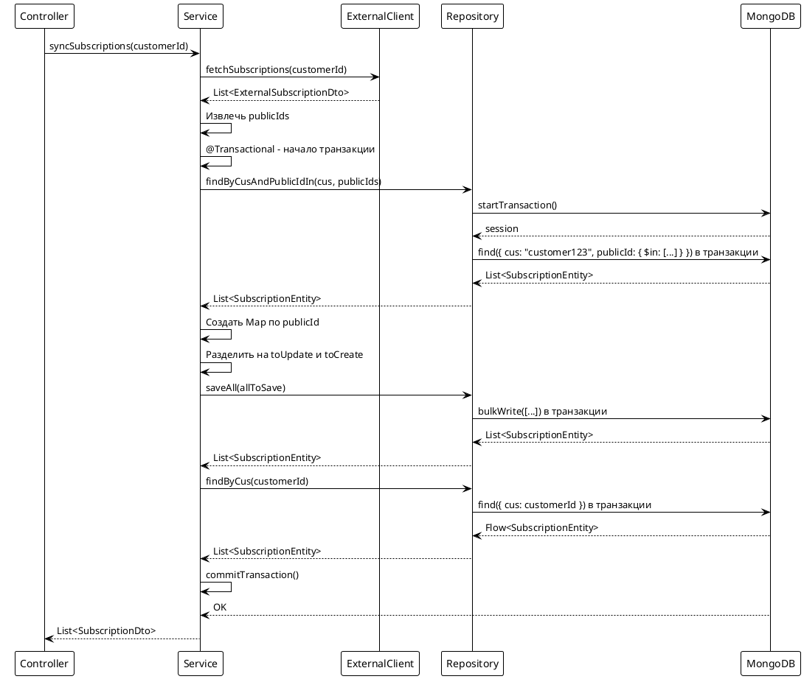
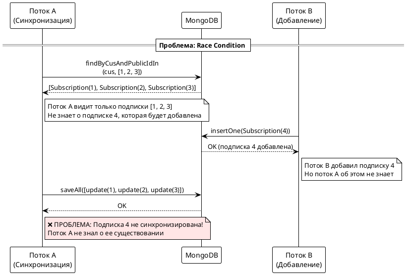
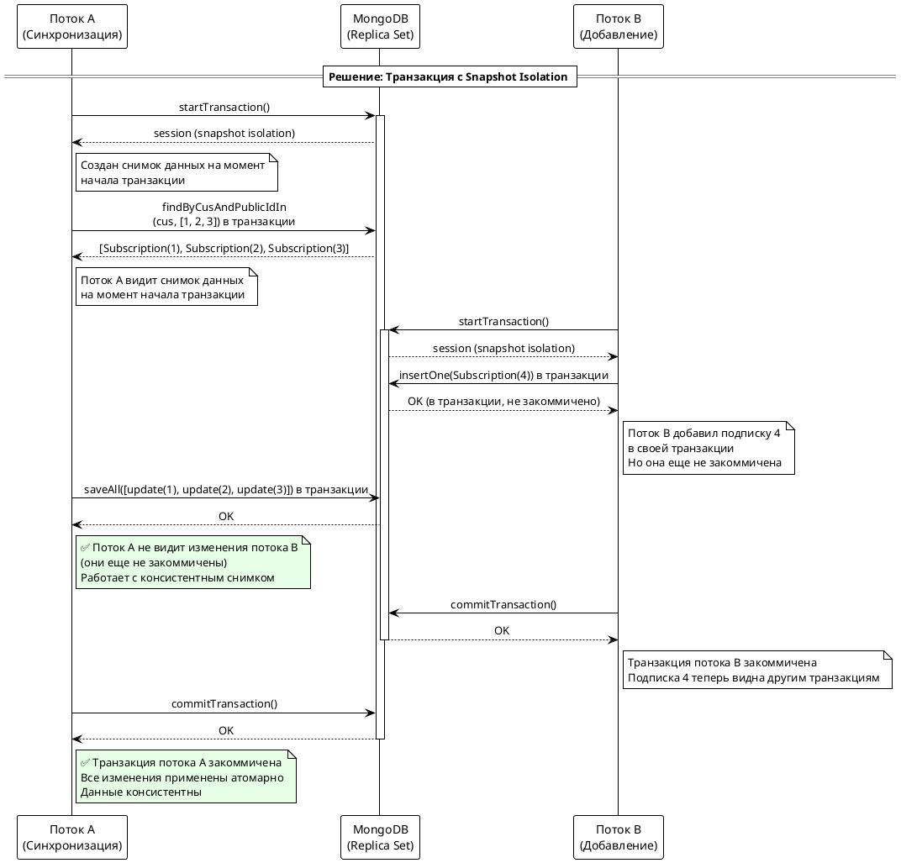
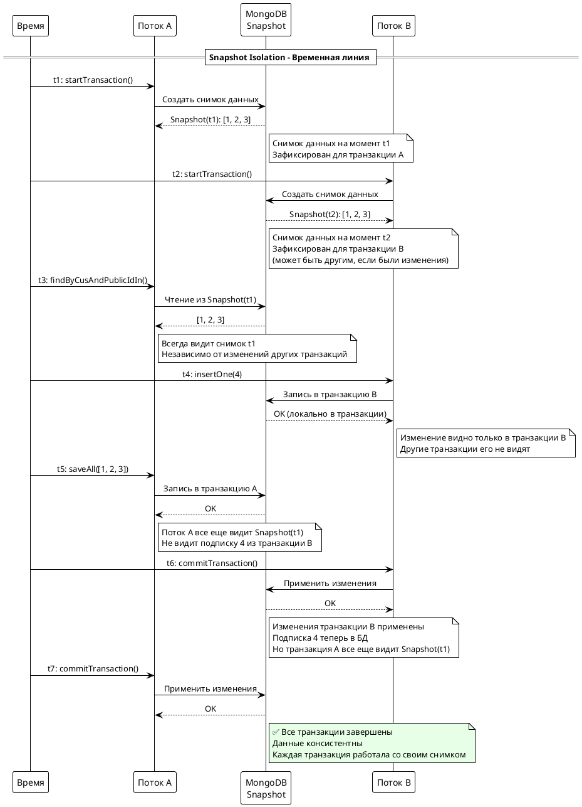

# Подход 3: Оптимизированные нативные запросы с транзакциями

## Содержание

- [Описание](#описание)
- [Архитектура](#архитектура)
- [Реализация](#реализация)
- [Запросы к БД](#запросы-к-бд)
- [Особенности Kotlin](#особенности-kotlin)
- [Решение проблемы race condition](#решение-проблемы-race-condition)
- [Преимущества и недостатки](#преимущества-и-недостатки)

## Описание

Подход использует оптимизированные нативные запросы MongoDB через `@Query` аннотации в сочетании с транзакциями для обеспечения ACID свойств. Вместо загрузки всех подписок клиента, выполняется запрос только для нужных подписок по списку `publicId`. Все операции выполняются в транзакции для предотвращения race conditions (неповторяемое чтение).

## Архитектура



## Реализация

### Контроллер

```kotlin
@RestController
@RequestMapping("/api/subscriptions/sync")
class SubscriptionSyncController3(
    private val syncService: SubscriptionSyncService3
) {
    @PostMapping("/approach3")
    suspend fun syncSubscriptionsApproach3(
        @RequestHeader("AUTH-USER-ID") authUserId: String
    ): ResponseEntity<List<SubscriptionDto>> {
        val subscriptions = syncService.syncSubscriptions(authUserId)
        return ResponseEntity.ok(subscriptions)
    }
}
```

### Сервис

```kotlin
@Service
class SubscriptionSyncService3(
    private val repository: SubscriptionRepository,
    private val externalClient: ExternalSubscriptionClient,
    private val mapper: ExternalSubscriptionMapper
) {
    @Transactional
    suspend fun syncSubscriptions(customerId: String): List<SubscriptionDto> {
        // Шаг 1: Получаем данные от внешнего сервиса
        val externalResponse = externalClient.fetchSubscriptions(customerId)
        val externalSubscriptions = externalResponse.subscriptions

        // Шаг 2: Извлекаем список publicId из внешних подписок
        val externalPublicIds = externalSubscriptions.map { 
            UUID.fromString(it.subscriptionId) 
        }

        // Шаг 3: Оптимизированный поиск существующих подписок В ТРАНЗАКЦИИ
        // Один запрос только для нужных подписок
        // Транзакция обеспечивает snapshot isolation - видим консистентный снимок данных
        val existingSubscriptions = repository.findByCusAndPublicIdIn(
            customerId, 
            externalPublicIds
        )

        // Шаг 4: Создаем Map для быстрого поиска
        val existingMap = existingSubscriptions.associateBy { it.publicId }

        // Шаг 5: Разделяем подписки на обновляемые и новые
        val toUpdate = mutableListOf<SubscriptionEntity>()
        val toCreate = mutableListOf<SubscriptionEntity>()

        externalSubscriptions.forEach { externalDto ->
            val publicId = UUID.fromString(externalDto.subscriptionId)
            val existing = existingMap[publicId]

            if (existing != null) {
                mapper.updateEntity(existing, externalDto)
                toUpdate.add(existing)
            } else {
                val newEntity = mapper.toEntity(externalDto, customerId)
                toCreate.add(newEntity)
            }
        }

        // Шаг 6: Batch сохранение В ТРАНЗАКЦИИ
        // Все операции выполняются атомарно
        val allToSave = toUpdate + toCreate
        if (allToSave.isNotEmpty()) {
            repository.saveAll(allToSave).toList()
        }

        // Шаг 7: Загружаем обновленные данные для возврата (все еще в транзакции)
        val result = repository.findByCus(customerId).toList()
        return result.map { entity -> /* преобразование в DTO */ }
    }
}
```

### Repository

```kotlin
@Repository
interface SubscriptionRepository : CoroutineCrudRepository<SubscriptionEntity, ObjectId> {
    fun findByCus(cus: String): Flow<SubscriptionEntity>
    
    @Query("{ 'cus': ?0, 'publicId': { \$in: ?1 } }")
    suspend fun findByCusAndPublicIdIn(
        cus: String, 
        publicIds: List<UUID>
    ): List<SubscriptionEntity>
}
```

## Запросы к БД

### Метод 1: findByCusAndPublicIdIn

**Нативный запрос с @Query:**
```kotlin
@Query("{ 'cus': ?0, 'publicId': { \$in: ?1 } }")
suspend fun findByCusAndPublicIdIn(
    cus: String, 
    publicIds: List<UUID>
): List<SubscriptionEntity>
```

**Что происходит:**
- `?0` - первый параметр метода (`cus`)
- `?1` - второй параметр метода (`publicIds`)
- `$in` - MongoDB оператор для поиска в массиве
- Запрос ищет подписки, где `cus` равен указанному значению И `publicId` находится в списке

**MongoDB запрос:**
```json
{
  "cus": "customer123",
  "publicId": {
    "$in": [
      UUID("550e8400-e29b-41d4-a716-446655440000"),
      UUID("550e8400-e29b-41d4-a716-446655440001")
    ]
  }
}
```

**Особенности индексов:**
- Использует составной индекс на `cus` и `publicId`
- Индекс `@Indexed` на `cus` ускоряет фильтрацию
- Индекс `@Indexed(unique = true)` на `publicId` обеспечивает уникальность

**Преимущества:**
- Загружает только нужные подписки, а не все подписки клиента
- Эффективно при большом количестве подписок у клиента
- Минимизирует объем данных, передаваемых из БД

### Метод 2: saveAll

**Метод из CoroutineCrudRepository:**
```kotlin
fun saveAll(entities: Iterable<SubscriptionEntity>): Flow<SubscriptionEntity>
```

**MongoDB запрос (bulkWrite):**
```json
{
  "operations": [
    { "updateOne": { "filter": { "_id": ObjectId("...") }, "update": { "$set": {...} } } },
    { "insertOne": { "document": {...} } }
  ]
}
```

## Решение проблемы race condition

### Проблема: Неповторяемое чтение

**Сценарий без транзакции:**



**Что происходит:**
1. Поток A: Загружает существующие подписки через `findByCusAndPublicIdIn` (находит [1, 2, 3])
2. Поток B: Добавляет новую подписку с publicId 4
3. Поток A: Сохраняет изменения через `saveAll` (обновляет 1, 2, 3, но не знает о 4)
4. Результат: Подписка 4 не синхронизирована

### Решение через транзакцию

**Сценарий с транзакцией и snapshot isolation:**



**Что происходит:**
1. Поток A: Начинает транзакцию с snapshot isolation (создается снимок данных)
2. Поток A: Загружает существующие подписки (видит снимок на момент начала транзакции)
3. Поток B: Добавляет новую подписку с publicId 4 (в своей транзакции, еще не закоммичена)
4. Поток A: Сохраняет изменения (не видит изменения потока B, так как они еще не закоммичены)
5. Поток B: Commit транзакции (подписка 4 становится видимой)
6. Поток A: Commit транзакции (все изменения применены атомарно)
7. Результат: Обе транзакции успешно завершены, данные консистентны

### Как работает snapshot isolation

**MongoDB транзакции:**
- Создают снимок данных на момент начала транзакции
- Все операции чтения видят этот снимок
- Изменения других транзакций не видны до их commit
- Гарантирует консистентность данных

**Визуализация snapshot isolation:**



**В Spring Data MongoDB:**
```kotlin
@Transactional
suspend fun syncSubscriptions(customerId: String): List<SubscriptionDto> {
    // Все операции Repository автоматически выполняются в транзакции
    // Spring создает транзакцию MongoDB и связывает ее с корутиной
    // Snapshot isolation обеспечивается автоматически
}
```

## Особенности Kotlin

### 1. Нативные запросы с @Query

**Синтаксис:**
```kotlin
@Query("{ 'cus': ?0, 'publicId': { \$in: ?1 } }")
suspend fun findByCusAndPublicIdIn(cus: String, publicIds: List<UUID>): List<SubscriptionEntity>
```

**Параметры:**
- `?0`, `?1` - позиционные параметры (соответствуют параметрам метода по порядку)
- `\$in` - экранированный символ `$` для MongoDB оператора `$in`
- Spring Data MongoDB автоматически преобразует параметры в BSON

### 2. Suspend функции и транзакции

**Важно:**
- Spring Data MongoDB поддерживает транзакции в suspend функциях
- `@Transactional` аннотация создает транзакцию MongoDB для корутины
- Все операции Repository автоматически выполняются в транзакции
- При успешном завершении - commit, при ошибке - автоматический rollback

### 3. Scope functions: associateBy

```kotlin
val existingMap = existingSubscriptions.associateBy { it.publicId }
```

Создает Map для O(1) поиска существующих подписок.

## Преимущества и недостатки

### Преимущества:

1. **Оптимизация запросов** - загружаются только нужные подписки, а не все
2. **Эффективность памяти** - минимизирован объем данных в памяти
3. **Масштабируемость** - работает эффективно даже при большом количестве подписок у клиента
4. **Batch операции** - все изменения сохраняются одним запросом
5. **ACID гарантии** - транзакции обеспечивают атомарность и изоляцию
6. **Защита от race conditions** - snapshot isolation предотвращает неповторяемое чтение

### Недостатки:

1. **Сложнее запрос** - требует понимания MongoDB синтаксиса
2. **Дополнительный запрос** - загружаем подписки дважды (оптимизированный запрос и для возврата)
3. **Зависимость от индексов** - эффективность зависит от правильных индексов
4. **Требования к инфраструктуре** - нужен replica set или sharded cluster
5. **Производительность** - транзакции могут быть медленнее из-за блокировок

### Когда использовать:

- Когда у клиента может быть много подписок (> 1000)
- Когда важна оптимизация объема данных из БД
- Когда нужно минимизировать использование памяти
- Когда критически важна целостность данных (ACID)
- В production окружениях с большими объемами данных и replica set
- Когда возможны параллельные операции синхронизации

### Требования:

- MongoDB 4.0+ (поддержка транзакций)
- Replica set или sharded cluster
- Spring Data MongoDB 2.1+ (поддержка транзакций в корутинах)

