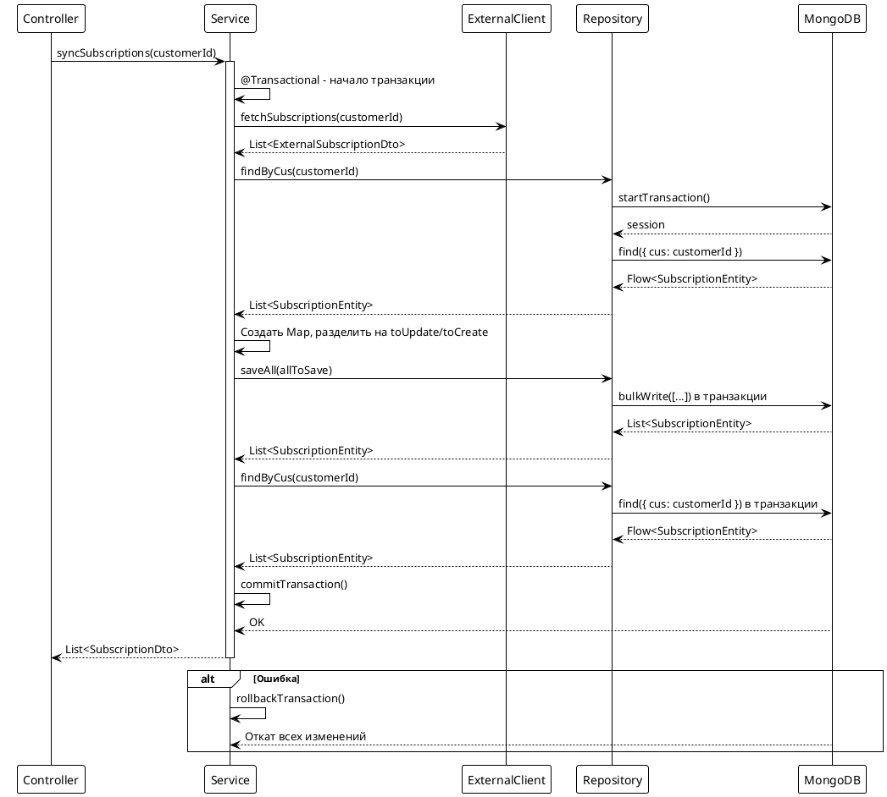

# Подход 4: Транзакционная обработка

## Содержание

- [Описание](#описание)
- [Архитектура](#архитектура)
- [Реализация](#реализация)
- [Запросы к БД](#запросы-к-бд)
- [Особенности Kotlin](#особенности-kotlin)
- [Преимущества и недостатки](#преимущества-и-недостатки)

## Описание

Подход использует транзакции MongoDB для атомарной обработки всех операций синхронизации. Все изменения выполняются в одной транзакции: либо все операции успешны, либо все откатываются. Гарантирует целостность данных при ошибках.

**Важно:** MongoDB транзакции требуют replica set или sharded cluster. В standalone режиме транзакции не поддерживаются.

## Архитектура



## Реализация

### Контроллер

```kotlin
@RestController
@RequestMapping("/api/subscriptions/sync")
class SubscriptionSyncController4(
    private val syncService: SubscriptionSyncService4
) {
    @PostMapping("/approach4")
    suspend fun syncSubscriptionsApproach4(
        @RequestHeader("AUTH-USER-ID") authUserId: String
    ): ResponseEntity<List<SubscriptionDto>> {
        val subscriptions = syncService.syncSubscriptions(authUserId)
        return ResponseEntity.ok(subscriptions)
    }
}
```

### Сервис

```kotlin
@Service
class SubscriptionSyncService4(
    private val repository: SubscriptionRepository,
    private val externalClient: ExternalSubscriptionClient,
    private val mapper: ExternalSubscriptionMapper
) {
    @Transactional
    suspend fun syncSubscriptions(customerId: String): List<SubscriptionDto> {
        try {
            // Шаг 1: Получаем данные от внешнего сервиса
            val externalResponse = externalClient.fetchSubscriptions(customerId)
            val externalSubscriptions = externalResponse.subscriptions

            // Шаг 2: Загружаем существующие подписки из MongoDB
            // В транзакции все операции выполняются атомарно
            val existingSubscriptions = repository.findByCus(customerId).toList()

            // Шаг 3: Создаем Map для быстрого поиска по publicId
            val existingMap = existingSubscriptions.associateBy { it.publicId }

            // Шаг 4: Разделяем подписки на обновляемые и новые
            val toUpdate = mutableListOf<SubscriptionEntity>()
            val toCreate = mutableListOf<SubscriptionEntity>()

            externalSubscriptions.forEach { externalDto ->
                val publicId = UUID.fromString(externalDto.subscriptionId)
                val existing = existingMap[publicId]

                if (existing != null) {
                    mapper.updateEntity(existing, externalDto)
                    toUpdate.add(existing)
                } else {
                    val newEntity = mapper.toEntity(externalDto, customerId)
                    toCreate.add(newEntity)
                }
            }

            // Шаг 5: Batch сохранение в транзакции
            // Если произойдет ошибка - все изменения откатятся
            val allToSave = toUpdate + toCreate
            if (allToSave.isNotEmpty()) {
                repository.saveAll(allToSave).toList()
            }

            // Шаг 6: Загружаем обновленные данные для возврата
            // Все еще в рамках транзакции
            val result = repository.findByCus(customerId).toList()
            return result.map { entity -> /* преобразование в DTO */ }
        } catch (ex: Exception) {
            // При ошибке транзакция автоматически откатится
            log.error("Ошибка в транзакции. Все изменения будут откачены.", ex)
            throw ex
        }
    }
}
```

### Repository

```kotlin
@Repository
interface SubscriptionRepository : CoroutineCrudRepository<SubscriptionEntity, ObjectId> {
    fun findByCus(cus: String): Flow<SubscriptionEntity>
}
```

## Запросы к БД

### Транзакция MongoDB

**Что происходит:**
- `@Transactional` аннотация создает транзакцию MongoDB
- Все операции в методе выполняются в рамках одной транзакции
- При успешном завершении - commit транзакции
- При ошибке - автоматический rollback всех изменений

**MongoDB операции в транзакции:**
```javascript
session.startTransaction()
try {
    // find операции
    db.subscriptions.find({ cus: "customer123" })
    
    // bulkWrite операции
    db.subscriptions.bulkWrite([
        { updateOne: { filter: {...}, update: {...} } },
        { insertOne: { document: {...} } }
    ])
    
    session.commitTransaction()
} catch (error) {
    session.abortTransaction()
    throw error
}
```

**Особенности:**
- Все операции выполняются с изоляцией
- Другие транзакции не видят незафиксированные изменения
- Гарантируется ACID свойства

## Особенности Kotlin

### 1. @Transactional аннотация

**Использование:**
```kotlin
@Transactional
suspend fun syncSubscriptions(customerId: String): List<SubscriptionDto> {
    // Все операции в этом методе выполняются в транзакции
}
```

**Как работает:**
- Spring создает прокси для сервиса
- При вызове метода создается транзакция MongoDB
- Все операции Repository автоматически выполняются в транзакции
- При успешном завершении - commit
- При исключении - rollback

### 2. Suspend функции и транзакции

**Важно:**
- Spring Data MongoDB поддерживает транзакции в suspend функциях
- Транзакция распространяется на все suspend операции Repository
- Корутины корректно работают с транзакционным контекстом

### 3. Обработка ошибок

```kotlin
try {
    // операции в транзакции
} catch (ex: Exception) {
    // Транзакция автоматически откатится
    throw ex
}
```

**Что происходит:**
- При любом исключении Spring автоматически вызывает `abortTransaction()`
- Все изменения в БД откатываются
- Исключение пробрасывается дальше

## Преимущества и недостатки

### Преимущества:

1. **Атомарность** - все операции выполняются как единое целое
2. **Целостность данных** - гарантируется консистентность при ошибках
3. **Откат при ошибках** - все изменения автоматически откатываются
4. **Изоляция** - другие транзакции не видят незафиксированные изменения

### Недостатки:

1. **Требования к инфраструктуре** - нужен replica set или sharded cluster
2. **Производительность** - транзакции могут быть медленнее из-за блокировок
3. **Сложность** - требует понимания транзакций MongoDB
4. **Ограничения** - не работает в standalone режиме

### Когда использовать:

- Когда критически важна целостность данных
- Когда нужна атомарность всех операций синхронизации
- В production окружениях с replica set
- Когда возможны ошибки и нужен автоматический откат

### Требования:

- MongoDB 4.0+ (поддержка транзакций)
- Replica set или sharded cluster
- Spring Data MongoDB 2.1+ (поддержка транзакций в корутинах)


