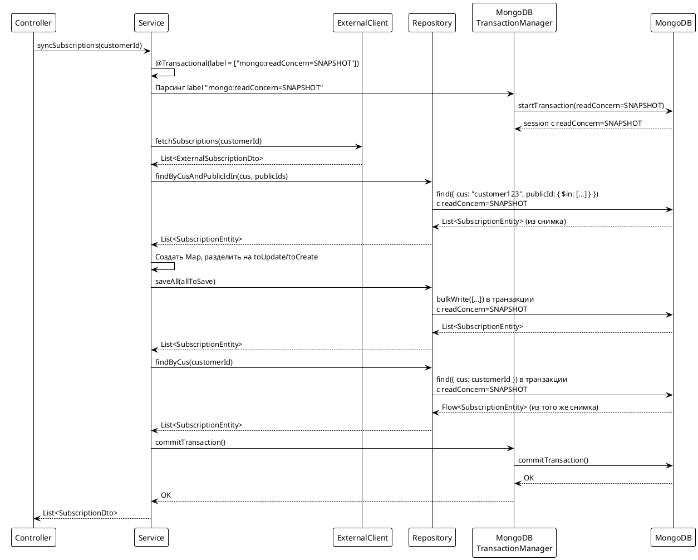
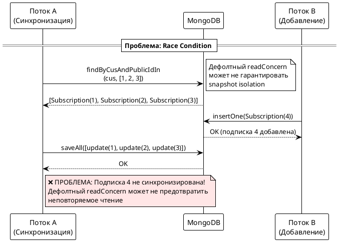
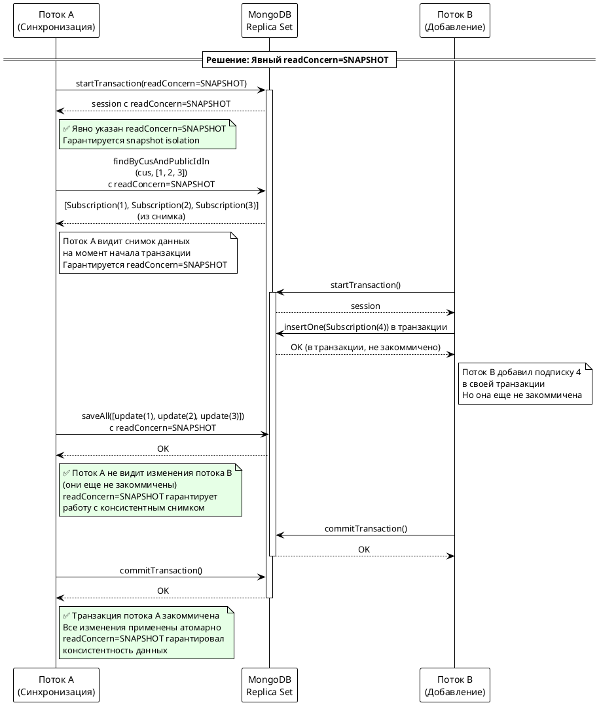

# Подход 5: Транзакции с явным readConcern=SNAPSHOT через transaction labels

## Содержание

- [Описание](#описание)
- [Архитектура](#архитектура)
- [Реализация](#реализация)
- [Transaction Labels в Spring Data MongoDB](#transaction-labels-в-spring-data-mongodb)
- [Запросы к БД](#запросы-к-бд)
- [Решение проблемы race condition](#решение-проблемы-race-condition)
- [Особенности Kotlin](#особенности-kotlin)
- [Преимущества и недостатки](#преимущества-и-недостатки)

## Описание

Подход использует оптимизированные нативные запросы MongoDB в сочетании с транзакциями, где **явно указан `readConcern=SNAPSHOT`** через transaction labels.

**Важно: Snapshot isolation работает БЕЗ явного указания label!**

MongoDB транзакции **по умолчанию** имеют snapshot isolation на уровне транзакции, независимо от указанного readConcern. Это означает, что даже без label все операции внутри транзакции видят один консистентный снимок данных на момент начала транзакции.[^2][^3]

**Ключевое отличие от подхода 3:**
- Подход 3: Использует дефолтный readConcern транзакции (snapshot isolation работает автоматически)
- Подход 5: **Явно указывает `readConcern=SNAPSHOT`** через `@Transactional(label = ["mongo:readConcern=SNAPSHOT"])` для гарантии majority-committed данных

**Зачем тогда нужен label с readConcern=SNAPSHOT?**

Label нужен для явного контроля **УРОВНЯ snapshot**:
- `readConcern: "local"` — snapshot на уровне транзакции, но данные могут быть не majority-committed[^6][^1]
- `readConcern: "snapshot"` — snapshot **из majority-committed данных**, гарантия что данные не откатятся при failover[^5][^7]
- `readConcern: "majority"` — тоже majority-committed, но без гарантии snapshot для multi-shard операций[^7][^8]

**Когда нужен label с readConcern=SNAPSHOT:**
- Работа с **sharded cluster** и нужна консистентность между шардами[^14][^8]
- Критично, чтобы данные были **majority-committed** и не откатились при failover[^5][^7]
- Нужна явная гарантия, что читаются только majority-committed данные

**Для replica set с single-shard операциями** (как в нашем случае) дефолтного поведения достаточно, но явное указание readConcern=SNAPSHOT делает код более явным и понятным.[^2][^3]

## Архитектура



## Реализация

### Контроллер

```kotlin
@RestController
@RequestMapping("/api/subscriptions/sync")
class SubscriptionSyncController5(
    private val syncService: SubscriptionSyncService5
) {
    @PostMapping("/approach5")
    suspend fun syncSubscriptionsApproach5(
        @RequestHeader("AUTH-USER-ID") authUserId: String
    ): ResponseEntity<List<SubscriptionDto>> {
        val subscriptions = syncService.syncSubscriptions(authUserId)
        return ResponseEntity.ok(subscriptions)
    }
}
```

### Сервис

```kotlin
@Service
class SubscriptionSyncService5(
    private val repository: SubscriptionRepository,
    private val externalClient: ExternalSubscriptionClient,
    private val mapper: ExternalSubscriptionMapper
) {
    /**
     * Явное указание readConcern=SNAPSHOT через transaction label
     * Spring Data MongoDB парсит метку "mongo:readConcern=SNAPSHOT"
     * и применяет ReadConcern.SNAPSHOT к TransactionOptions
     */
    @Transactional(label = ["mongo:readConcern=SNAPSHOT"])
    suspend fun syncSubscriptions(customerId: String): List<SubscriptionDto> {
        // Шаг 1: Получаем данные от внешнего сервиса
        val externalResponse = externalClient.fetchSubscriptions(customerId)
        val externalSubscriptions = externalResponse.subscriptions

        // Шаг 2: Извлекаем список publicId
        val externalPublicIds = externalSubscriptions.map { 
            UUID.fromString(it.subscriptionId) 
        }

        // Шаг 3: Оптимизированный поиск с readConcern=SNAPSHOT
        // Все операции find видят один снимок данных на момент начала транзакции
        val existingSubscriptions = repository.findByCusAndPublicIdIn(
            customerId, 
            externalPublicIds
        )

        // Шаг 4: Создаем Map для быстрого поиска
        val existingMap = existingSubscriptions.associateBy { it.publicId }

        // Шаг 5: Разделяем подписки на обновляемые и новые
        val toUpdate = mutableListOf<SubscriptionEntity>()
        val toCreate = mutableListOf<SubscriptionEntity>()

        externalSubscriptions.forEach { externalDto ->
            val publicId = UUID.fromString(externalDto.subscriptionId)
            val existing = existingMap[publicId]

            if (existing != null) {
                mapper.updateEntity(existing, externalDto)
                toUpdate.add(existing)
            } else {
                val newEntity = mapper.toEntity(externalDto, customerId)
                toCreate.add(newEntity)
            }
        }

        // Шаг 6: Batch сохранение в транзакции с readConcern=SNAPSHOT
        val allToSave = toUpdate + toCreate
        if (allToSave.isNotEmpty()) {
            repository.saveAll(allToSave).toList()
        }

        // Шаг 7: Загружаем обновленные данные (все еще в транзакции)
        // readConcern=SNAPSHOT гарантирует консистентность данных
        val result = repository.findByCus(customerId).toList()
        return result.map { entity -> /* преобразование в DTO */ }
    }
}
```

### Repository

```kotlin
@Repository
interface SubscriptionRepository : CoroutineCrudRepository<SubscriptionEntity, ObjectId> {
    fun findByCus(cus: String): Flow<SubscriptionEntity>
    
    @Query("{ 'cus': ?0, 'publicId': { \$in: ?1 } }")
    suspend fun findByCusAndPublicIdIn(
        cus: String, 
        publicIds: List<UUID>
    ): List<SubscriptionEntity>
}
```

## Snapshot Isolation: Дефолтное поведение vs Явное указание

### Дефолтное поведение MongoDB транзакций

**Важно:** MongoDB транзакции **по умолчанию** имеют snapshot isolation на уровне транзакции, независимо от указанного readConcern.[^2][^3]

Это означает:
- Все операции внутри транзакции видят **один консистентный снимок данных** на момент начала транзакции[^2][^3]
- Даже если вы явно укажете `readConcern: "local"`, транзакция всё равно будет вести себя как snapshot на **уровне транзакции**[^3]
- Snapshot isolation **работает автоматически** без явного указания label

**Цитата из обсуждения:**[^2]
> "With regard to transactions (which requires the use of sessions), **the default isolation is snapshot**."

**Подтверждение:**[^3]
> "The transaction is acting as a snapshot when I'm clearly setting readConcern to local."

### Зачем тогда нужен label с readConcern=SNAPSHOT?

Атрибут `label = ["mongo:readConcern=SNAPSHOT"]` нужен для **явного контроля УРОВНЯ snapshot**:[^4][^5]

**Разница между уровнями:**

1. **`readConcern: "local"`** — snapshot на уровне транзакции, но данные могут быть не majority-committed[^6][^1]
   - Видите снимок данных на момент начала транзакции
   - Но данные могут быть не подтверждены большинством узлов
   - При failover данные могут откатиться

2. **`readConcern: "snapshot"`** — snapshot **из majority-committed данных**, гарантия что данные не откатятся при failover[^5][^7]
   - Видите снимок данных на момент начала транзакции
   - **Гарантируется**, что данные подтверждены большинством узлов
   - При failover данные не откатятся
   - Обеспечивает консистентность между шардами в sharded cluster

3. **`readConcern: "majority"`** — тоже majority-committed, но без гарантии snapshot для multi-shard операций[^7][^8]
   - Данные подтверждены большинством узлов
   - Но нет гарантии snapshot для операций между шардами

### Когда нужен label с readConcern=SNAPSHOT?

Указывать `label = ["mongo:readConcern=SNAPSHOT"]` нужно только если:[^8][^5]

1. **Работаете с sharded cluster** и нужна консистентность между шардами[^14][^8]
2. **Критично, чтобы данные были majority-committed** и не откатились при failover[^5][^7]
3. **Нужна явная гарантия**, что читаются только majority-committed данные

**Для replica set с single-shard операциями** (как в нашем случае) дефолтного поведения достаточно, так как snapshot isolation работает автоматически.[^2][^3] Однако явное указание `readConcern=SNAPSHOT` делает код более явным и добавляет гарантию majority-committed данных.

## Transaction Labels в Spring Data MongoDB

### Что такое transaction labels?

Transaction labels — это механизм Spring Framework для передачи меток транзакциям. Атрибут `label()` в `@Transactional` позволяет задавать произвольные метки, которые могут интерпретироваться менеджерами транзакций.

**Документация Spring Framework:**
> "Labels may be used to describe a transaction, and they can be evaluated by individual transaction managers. Labels may serve a solely descriptive purpose or map to pre-defined transaction manager-specific options."

### Как Spring Data MongoDB использует labels

**Официальная документация Spring Data MongoDB:**[^1]

> "Spring Data MongoDB's transaction managers support evaluation of transaction labels such as `@Transactional(label = { "mongo:readConcern=available" })`."

И далее:

> "Sets the read concern for the transaction.  
> Usage: `mongo:readConcern=LOCAL|MAJORITY|LINEARIZABLE|SNAPSHOT|AVAILABLE`"

**Как это работает:**
- `MongoTransactionManager` и `ReactiveMongoTransactionManager` **специально парсят** метки с префиксом `mongo:`
- Парсятся метки и применяются к `TransactionOptions`
- Это позволяет настраивать MongoDB-специфичные параметры транзакций на уровне метода

### Доступные метки для MongoDB

Spring Data MongoDB распознаёт следующие метки:[^1]

1. **`mongo:readConcern=LOCAL|MAJORITY|LINEARIZABLE|SNAPSHOT|AVAILABLE`**
   - Уровень читаемости (read concern)
   - Определяет, какие данные видны при чтении

2. **`mongo:readPreference=PRIMARY|SECONDARY|SECONDARY_PREFERRED|PRIMARY_PREFERRED|NEAREST`**
   - Предпочтение при чтении
   - Определяет, с какого узла replica set читать данные

3. **`mongo:writeConcern=...`**
   - Подтверждение записи (write concern)
   - Определяет, сколько узлов должны подтвердить запись

### Пример использования

```kotlin
@Transactional(label = ["mongo:readConcern=SNAPSHOT"])
suspend fun syncSubscriptions(customerId: String): List<SubscriptionDto> {
    // Все операции внутри будут использовать readConcern=SNAPSHOT
}
```

**Эквивалентно программной настройке:**[^3][^4]

```kotlin
@Bean
fun mongoTransactionManager(dbFactory: MongoDatabaseFactory): MongoTransactionManager {
    val options = TransactionOptions.builder()
        .readConcern(ReadConcern.SNAPSHOT)
        .writeConcern(WriteConcern.MAJORITY)
        .build()
    return MongoTransactionManager(dbFactory, options)
}
```

**Преимущество через label:**
- Можно задавать опции **на уровне отдельного метода**, а не глобально для всех транзакций
- Разные методы могут использовать разные readConcern
- Более гибкая и явная настройка
- Гарантирует majority-committed snapshot (защита от отката при failover)

## Запросы к БД

### Метод 1: findByCusAndPublicIdIn с readConcern=SNAPSHOT

**Нативный запрос с @Query:**
```kotlin
@Query("{ 'cus': ?0, 'publicId': { \$in: ?1 } }")
suspend fun findByCusAndPublicIdIn(
    cus: String, 
    publicIds: List<UUID>
): List<SubscriptionEntity>
```

**Что происходит:**
- Запрос выполняется в транзакции с `readConcern=SNAPSHOT`
- MongoDB использует снимок данных на момент начала транзакции
- Все операции чтения видят один и тот же снимок

**MongoDB запрос:**
```json
{
  "readConcern": { "level": "snapshot" },
  "operations": [
    {
      "find": "subscriptions",
      "filter": {
        "cus": "customer123",
        "publicId": { "$in": [UUID("..."), UUID("...")] }
      }
    }
  ]
}
```

### Метод 2: saveAll с readConcern=SNAPSHOT

**Метод из CoroutineCrudRepository:**
```kotlin
fun saveAll(entities: Iterable<SubscriptionEntity>): Flow<SubscriptionEntity>
```

**Что происходит:**
- Все операции записи выполняются в транзакции с `readConcern=SNAPSHOT`
- При конфликте записи MongoDB выдаст `WriteConflict` и откатит транзакцию
- Гарантирует атомарность всех операций

**MongoDB запрос (bulkWrite в транзакции):**
```json
{
  "readConcern": { "level": "snapshot" },
  "operations": [
    { "updateOne": { "filter": { "_id": ObjectId("...") }, "update": { "$set": {...} } } },
    { "insertOne": { "document": {...} } }
  ]
}
```

## Решение проблемы race condition

### Проблема: Неповторяемое чтение

**Сценарий без явного readConcern=SNAPSHOT:**



### Решение через явный readConcern=SNAPSHOT

**Сценарий с явным readConcern=SNAPSHOT:**



### Как snapshot isolation решает проблему

**Важно:** Snapshot isolation работает **БЕЗ явного указания label**![^2][^3]

MongoDB транзакции по умолчанию имеют snapshot isolation на уровне транзакции. Это означает:[^2][^3]

1. **Все операции `find` внутри транзакции видят один снимок данных** на момент её начала[^2][^3]
   - Гарантируется, что все чтения видят консистентный снимок
   - Второй `findByCus()` вернет те же документы, что видел первый `findByCusAndPublicIdIn()`
   - **Работает даже без label!**

2. **Другие потоки могут добавлять/изменять документы параллельно, но транзакция их не увидит**[^6][^2]
   - Изменения других транзакций не видны до их commit
   - Предотвращает неповторяемое чтение
   - **Работает даже без label!**

3. **При конфликте записи MongoDB выдаст `WriteConflict` и откатит транзакцию**[^7][^2]
   - Вместо молчаливой потери данных
   - Гарантирует целостность данных

**Что добавляет явное указание readConcern=SNAPSHOT:**

С явным указанием `readConcern=SNAPSHOT`:[^5][^2][^6]

- Гарантирует, что читаются только **majority-committed данные**
- Защищает от отката данных при failover
- Обеспечивает консистентность между шардами в sharded cluster
- Делает код более явным и понятным

**Это устраняет неповторяемое чтение:** второй `findByCus()` вернёт те же документы, что видел первый `findByCusAndPublicIdIn()`.[^2][^6] Это работает и без label, но label гарантирует majority-committed snapshot.

## Особенности Kotlin

### 1. Transaction Labels в suspend функциях

**Использование:**
```kotlin
@Transactional(label = ["mongo:readConcern=SNAPSHOT"])
suspend fun syncSubscriptions(customerId: String): List<SubscriptionDto> {
    // Spring Data MongoDB парсит метку и применяет readConcern=SNAPSHOT
    // Все операции Repository автоматически выполняются в транзакции
    // с указанным readConcern
}
```

**Как работает:**
- Spring создает прокси для сервиса
- При вызове метода парсит метки с префиксом `mongo:`
- Создает транзакцию MongoDB с `readConcern=SNAPSHOT`
- Все операции Repository автоматически выполняются в транзакции
- При успешном завершении - commit, при ошибке - автоматический rollback

### 2. Suspend функции и транзакции

**Важно:**
- Spring Data MongoDB поддерживает транзакции в suspend функциях
- Transaction labels работают с корутинами
- Транзакция распространяется на все suspend операции Repository

### 3. Scope functions: associateBy

```kotlin
val existingMap = existingSubscriptions.associateBy { it.publicId }
```

Создает Map для O(1) поиска существующих подписок.

## Преимущества и недостатки

### Преимущества:

1. **Явное указание readConcern** - код более понятный и явный
2. **Гарантированный snapshot isolation** - явно указанный readConcern=SNAPSHOT
3. **Гибкость** - разные методы могут использовать разные readConcern
4. **Оптимизация запросов** - загружаются только нужные подписки
5. **Эффективность памяти** - минимизирован объем данных в памяти
6. **ACID гарантии** - транзакции обеспечивают атомарность и изоляцию
7. **Защита от race conditions** - readConcern=SNAPSHOT предотвращает неповторяемое чтение
8. **Best practices** - соответствует рекомендациям Spring Data MongoDB

### Недостатки:

1. **Сложнее запрос** - требует понимания MongoDB синтаксиса
2. **Дополнительный запрос** - загружаем подписки дважды
3. **Зависимость от индексов** - эффективность зависит от правильных индексов
4. **Требования к инфраструктуре** - нужен replica set или sharded cluster
5. **Производительность** - транзакции с readConcern=SNAPSHOT могут быть медленнее
6. **Требует понимания transaction labels** - нужно знать о метках Spring Data MongoDB

### Когда использовать:

- Когда критически важна целостность данных (ACID)
- Когда нужно явно гарантировать **majority-committed snapshot** (защита от отката при failover)
- Когда работаете с **sharded cluster** и нужна консистентность между шардами
- Когда разные методы требуют разных readConcern
- В production окружениях с replica set
- Когда возможны параллельные операции синхронизации
- Когда нужно следовать best practices Spring Data MongoDB
- Когда хотите сделать код более явным и понятным

**Примечание:** Для replica set с single-shard операциями (как в нашем случае) дефолтного поведения `@Transactional` достаточно, так как snapshot isolation работает автоматически. Явное указание `readConcern=SNAPSHOT` добавляет гарантию majority-committed данных.[^2][^3]

### Требования:

- MongoDB 4.0+ (поддержка транзакций)
- Replica set или sharded cluster
- Spring Data MongoDB 2.1+ (поддержка транзакций в корутинах)
- Spring Data MongoDB с поддержкой transaction labels

## Ссылки на документацию

[^1]: [MongoDB - Read Concern](https://www.mongodb.com/docs/manual/reference/read-concern/) - Официальная документация MongoDB по read concern

[^2]: [Changing MongoDB isolation level when mongo sessions involved](https://stackoverflow.com/questions/60156222/changing-mongodb-isolation-level-when-mongo-sessions-involved) - Stack Overflow: Snapshot isolation работает по умолчанию

[^3]: [Transaction with read concern local doesn't behave as expected](https://www.mongodb.com/community/forums/t/transaction-with-read-concern-local-doesnt-behave-as-expected/212937) - MongoDB форум: Транзакции ведут себя как snapshot

[^4]: [Spring Data MongoDB - Sessions & Transactions](https://docs.spring.io/spring-data/mongodb/reference/mongodb/client-session-transactions.html) - Официальная документация по transaction labels

[^5]: [MongoDB - Read Concern "snapshot"](https://www.mongodb.com/docs/manual/reference/read-concern-snapshot/) - Официальная документация MongoDB

[^6]: [MongoDB - Read Concern "local"](https://www.mongodb.com/docs/manual/reference/read-concern-local/) - Официальная документация MongoDB

[^7]: [MongoDB - Read Concern "majority"](https://www.mongodb.com/docs/manual/reference/read-concern-majority/) - Официальная документация MongoDB

[^8]: [MongoDB Performance Best Practices: Transactions And Read / Write Concerns](https://www.mongodb.com/resources/products/capabilities/performance-best-practices-transactions-and-read-write-concerns) - Best practices по производительности

[^9]: [Why replica set is mandatory for transactions in MongoDB](https://www.mongodb.com/community/forums/t/why-replica-set-is-mandatory-for-transactions-in-mongodb/9533) - MongoDB форум: Replica set обязателен для транзакций

[^10]: [Using Transactions in MongoDB](https://www.geeksforgeeks.org/mongodb/using-transactions-in-mongodb/) - Статья о транзакциях в MongoDB

[^11]: [MongoDB Multi-Document ACID Transactions General Availability](https://www.mongodb.com/company/blog/product-release-announcements/mongodb-multi-document-acid-transactions-general-availability) - Анонс ACID транзакций в MongoDB

[^12]: [MongoDB - Read Isolation, Consistency, and Recency](https://www.mongodb.com/docs/manual/core/read-isolation-consistency-recency/) - Официальная документация MongoDB

[^13]: [MongoDB Isolation Level Transactions](https://dzone.com/articles/mongodb-isolation-level-transactions) - Статья о уровнях изоляции

[^14]: [MongoDB Read Concern Snapshot](https://www.xuchao.org/docs/mongodb/reference/read-concern-snapshot.html) - Документация по read concern snapshot

